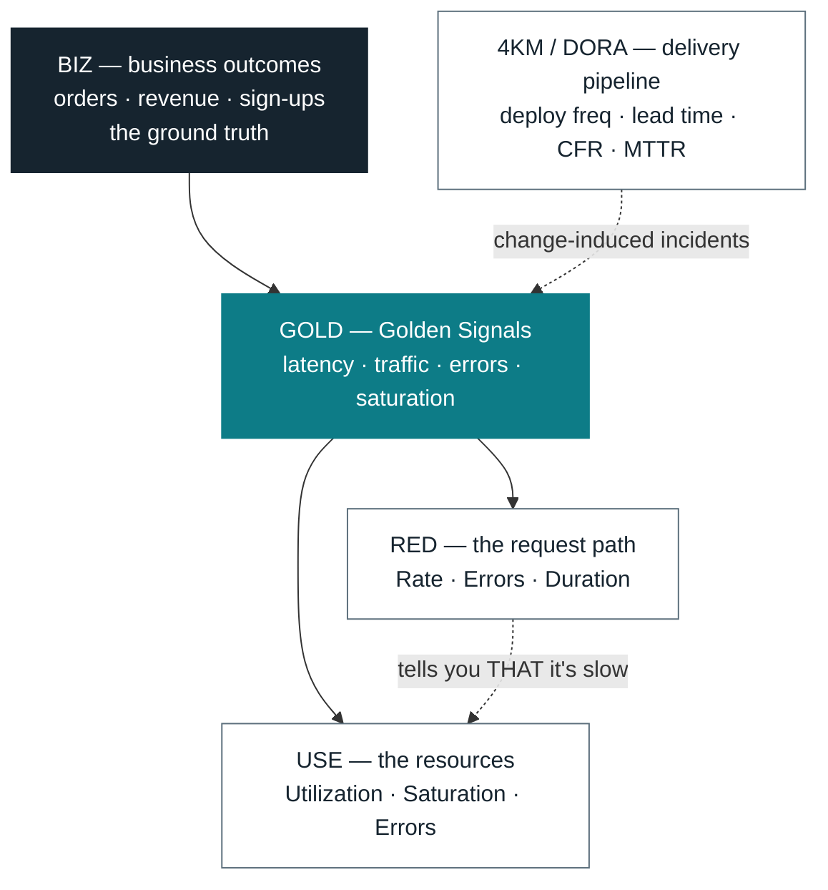
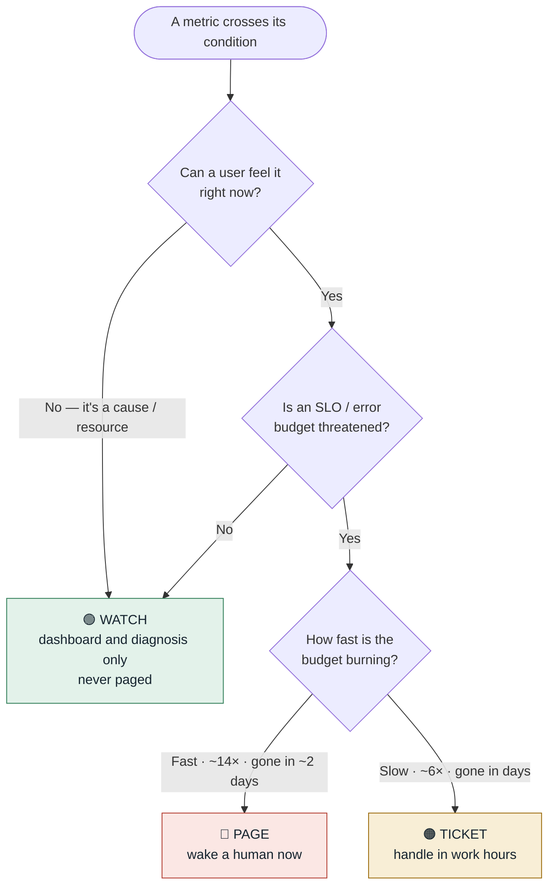
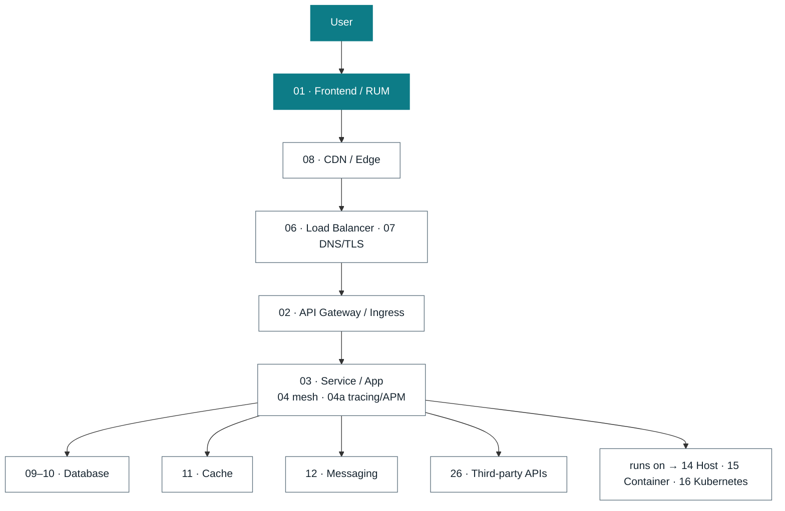

# Cloud-Native Observability — Master Metrics & Alerts Catalog

A generic, vendor-neutral master list of **everything worth observing** in a cloud-native
solution. Each metric is one row — **Metric · Method · Action · Detailed description** — where
the description covers *what it measures, why it matters, and the recommended alert*. Metric
names follow OpenTelemetry / Prometheus conventions.

> **All thresholds are starting points — tune against your own SLOs and baselines.**

**Method** (why the metric exists) = `RED` · `USE` · `GOLD` · `4KM` · `BIZ`.
**Action** (what an alert should do) = 🔴 Page · 🟠 Ticket · 🟢 Watch.
See [Methods & their theory](#methods--their-theory) for what each means.

---

## Table of contents

- [Methods & their theory](#methods--their-theory)
- [Glossary & abbreviations](#glossary--abbreviations)
- [Part A — The signal types](#part-a--the-signal-types)
- [Part B — Metrics by layer](#part-b--metrics-by-layer) — 01 Frontend · 02 API Gateway · 03 Service · 04 Mesh · 04a Tracing/APM · 05 Network · 06 Load Balancer · 07 DNS/TLS · 08 CDN · 09 DB-Relational · 10 DB-NoSQL · 11 Cache · 12 Messaging · 13 Storage · 14 Host · 15 Container · 16 Kubernetes · 17 Serverless · 18 Batch
- [Part B′ — Protocol & workload layers](#part-b--protocol--workload-specific-layers) — 19 gRPC · 20 GraphQL · 21 Real-time · 22 Search · 23 Vector DB · 24 Mobile · 25 Notifications · 26 Third-party
- [Part C — Cross-cutting dimensions](#part-c--cross-cutting-dimensions) — 27 Security · 28 Cost · 29 Business · 30 Data quality · 31 AI/ML · 32 DORA · 33 Backup/DR
- [Part C′ — Operational dimensions](#part-c--operational-dimensions) — 34 Alerting health · 35 Capacity · 36 Multi-tenancy · 37 Quotas · 38 Compliance · 39 Telemetry pipeline · 40 Sustainability
- [Part D — Cloud service map (Azure · AWS · GCP)](#part-d--cloud-service-map-azure--aws--gcp)
- [Part E — Operating the system](#part-e--operating-the-system)
- [Anti-noise rules](#anti-noise-rules)
- [References](#references)

---

## Methods & their theory

Five mental models tell you *what* to measure. None is complete on its own; each was invented to cover a blind spot the others leave, so you use them together, and every metric in this catalog is tagged with the model it serves.

### How they fit together

Read it top-down. Business outcomes are what actually matter. Golden Signals are the umbrella over any user-facing service. RED watches the *work flowing through*, USE watches the *things doing the work* (so RED tells you *that* it's slow and USE tells you *why*), and DORA watches how often your own changes are what broke it.

### The five at a glance

| Method | Question it answers | Applies to | Components | Origin |
|--------|--------------------|-----------|-----------|--------|
| **GOLD** | Is the service healthy for users? | any user-facing service | Latency · Traffic · Errors · Saturation | Google *SRE Book* |
| **RED** | Is this request path healthy? | services · endpoints · dependencies | Rate · Errors · Duration | Tom Wilkie (Weaveworks/Grafana) |
| **USE** | Is this resource healthy? | CPU · memory · disk · NIC · pools · queues | Utilization · Saturation · Errors | Brendan Gregg |
| **4KM** | Is our delivery healthy? | the CI/CD pipeline and team | Deploy freq · Lead time · CFR · MTTR | DORA / *Accelerate* |
| **BIZ** | Is the system delivering value? | product / business outcomes | domain events (orders, revenue…) | no single source |

### Golden Signals — the minimum viable set
From Google's *Site Reliability Engineering* book. **Latency, Traffic, Errors, Saturation.** The reason it endures is that it's *complete enough to be safe and few enough to remember*: those four together capture almost everything a user can feel. The one teams skip is **saturation** — how full the most-constrained resource is — and it's the leading indicator. Latency and errors tell you you're already hurting; saturation tells you it's coming while you still have time. *Use it as the umbrella for every user-facing service.*

### RED — Golden Signals for request traffic
Tom Wilkie's request-centric distillation: **Rate, Errors, Duration.** Apply it *per service and per endpoint*, because a service that looks healthy on average can hide one completely broken route inside that average. It deliberately drops saturation, because it describes the *request*, not the *resource*. *Example: checkout endpoint at 1,200 req/s, 0.3% errors, p99 480 ms — three numbers that tell you almost everything about that route.*

### USE — the mirror, for resources
Brendan Gregg's complement: for every resource, watch **Utilization** (fraction of time busy), **Saturation** (work queued beyond what it can serve), and **Errors**. The idea most people get wrong: *utilization alone is not an incident.* A CPU at 100% with an empty run queue is well-used, not sick; what hurts is saturation (load above core count, swap activity, I/O wait). RED says a service is slow; USE says which resource it's choking on. *Always read utilization next to its saturation partner.*

### Four Key Metrics (DORA) — delivery, not runtime
From the DORA research (*Accelerate*): **Deployment Frequency, Lead Time for Changes, Change-Failure Rate, MTTR.** Not runtime numbers — they measure how you *ship*, and the research found they separate strong engineering orgs from weak ones. They belong here because a large share of incidents are change-induced; a high change-failure rate is a reliability problem no CPU graph will show.

### Business signals — the ground truth
The events that represent *value*: orders, sign-ups, payments, revenue/min. A system can be green on every infrastructure metric while nobody can actually buy anything, because the break is in a business path your infra metrics never touch. A drop in successful transactions is often the **first** sign of an outage. Instrument outcomes with the same rigor you give latency.

> **Rule of thumb:** RED for request paths · USE for resources · Golden Signals as the umbrella · 4KM for the pipeline · BIZ as the ground truth.

### Why percentiles, not averages
Averages hide the tail. If p50 latency is 100 ms but p99 is 4 s, one request in a hundred — often your heaviest, highest-value users — has a terrible time while the average (maybe 140 ms) looks fine. Always track `p50 / p95 / p99` and `max`. One caveat: you **cannot average percentiles** across instances or scrape windows — a "p99 of p99s" is meaningless. Aggregate the underlying histogram buckets (e.g. `histogram_quantile` over summed `_bucket` rates) instead.

### Why burn rate, not raw thresholds
A static "errors > 1%" either pages on harmless blips or sleeps through a slow bleed. Reframe reliability as a **budget**: a 99.9% SLO allows 0.1% failure, ≈ 43 min/month. Then alert on how *fast* you're spending it — the **burn rate** — over two windows (a long one to avoid noise, a short one to clear fast once it recovers):

| Burn rate | Budget gone in | Long window | Short window | Action |
|-----------|---------------|-------------|--------------|--------|
| **14.4×** | ~2 days | 1 h | 5 m | 🔴 Page |
| **6×** | ~5 days | 6 h | 30 m | 🟠 Ticket (page if critical) |
| **3×** | ~10 days | 24 h | 2 h | 🟠 Ticket |
| **1×** | end of window | — | — | 🟢 none (on track) |

### Actions — page, ticket, or watch
Method tells you *what* to measure; the **action** tag tells you *what an alert should do*. The whole discipline is one rule: page only on something a user can feel, scaled to how fast the budget is burning.

Two corollaries: page on **symptoms, not causes** (high CPU is a cause, and possibly harmless — it belongs on a dashboard, not the pager), and alert on the **absence** of an expected signal too (a *dead-man's switch*: a job that should have run and didn't throws no error, so alert when its last success is too old).

---

## Glossary & abbreviations

**Reliability & methods**

| Term | Expansion / meaning |
|------|---------------------|
| **SLI** | Service Level Indicator — a measured signal of health (e.g. success ratio) |
| **SLO** | Service Level Objective — internal target for an SLI over a window (e.g. 99.9%/28d) |
| **SLA** | Service Level Agreement — contractual promise to customers, with penalties |
| **Error budget** | `1 − SLO`; allowed failure (99.9% ⇒ ~43 min/month) |
| **Burn rate** | Multiple of normal budget-consumption speed; drives multi-window alerting |
| **GOLD / RED / USE** | The three core metric methods (see above) |
| **4KM / DORA** | Four Key Metrics: Deploy Frequency, Lead Time, Change Failure Rate, MTTR |
| **BIZ** | Business/product outcome signal |
| **Saturation** | How "full" a resource is — work queued beyond what it can serve now |
| **Utilization** | Fraction of time/capacity a resource is busy |

**Incident & on-call**

| Term | Expansion / meaning |
|------|---------------------|
| **MTTD** | Mean Time To Detect — incident start → first alert |
| **MTTA** | Mean Time To Acknowledge — alert → human responds |
| **MTTR** | Mean Time To Restore/Repair — alert → resolved |
| **CFR** | Change Failure Rate — % of deploys causing an incident |
| **RPO** | Recovery Point Objective — max tolerable data loss (time) |
| **RTO** | Recovery Time Objective — max tolerable downtime to recover |
| **SEV1–4** | Severity levels, 1 = most severe |
| **Dead-man's switch** | Alert that fires on the *absence* of an expected signal |

**Latency & frontend**

| Term | Expansion / meaning |
|------|---------------------|
| **p50/p95/p99** | Percentiles — value below which 50/95/99% of samples fall |
| **APM** | Application Performance Monitoring |
| **RUM** | Real User Monitoring — telemetry from real browsers/devices |
| **CWV** | Core Web Vitals (Google UX metrics) |
| **LCP / INP / CLS** | Largest Contentful Paint / Interaction to Next Paint / Cumulative Layout Shift |
| **TTFB** | Time To First Byte |
| **Apdex** | Application Performance Index (satisfied/tolerating/frustrated) |
| **ANR** | Application Not Responding (mobile main-thread block) |
| **Jank** | Dropped/slow frames causing visible stutter |

**Network**

| Term | Expansion / meaning |
|------|---------------------|
| **RTT / PPS / MTU** | Round-Trip Time / Packets Per Second / Max Transmission Unit |
| **SNAT / NAT** | Source NAT / Network Address Translation (port exhaustion = outage) |
| **NSG / WAF / DDoS** | Network Security Group / Web App Firewall / Distributed Denial of Service |
| **BGP / ARP** | Routing & address-resolution protocols (ExpressRoute health) |
| **TLS / OCSP** | Transport encryption / certificate-revocation check |
| **TIME_WAIT** | TCP socket state after close; high counts exhaust ephemeral ports |

**Data, storage & messaging**

| Term | Expansion / meaning |
|------|---------------------|
| **QPS / OLTP** | Queries Per Second / Online Transaction Processing |
| **WAL** | Write-Ahead Log (Postgres) / redo log — durability journal |
| **DLQ** | Dead-Letter Queue — where unprocessable messages land |
| **ISR** | In-Sync Replicas (Kafka) |
| **N+1** | Anti-pattern: one query triggers N more (ORM/GraphQL) |
| **RU / DTU / DWU / SU** | Request / Database Transaction / Data Warehouse / Streaming Unit (cloud capacity currencies) |
| **RCU / WCU** | Read/Write Capacity Units (DynamoDB-style) |
| **ANN / recall@k** | Approximate Nearest Neighbor / % of true top-k returned (vector search) |
| **RAG** | Retrieval-Augmented Generation |

**Platform & cloud-native**

| Term | Expansion / meaning |
|------|---------------------|
| **OTel / TSDB** | OpenTelemetry / Time-Series Database |
| **HPA / etcd / CoreDNS** | Horizontal Pod Autoscaler / cluster key-value store / in-cluster DNS |
| **PV / PVC** | Persistent Volume / Persistent Volume Claim |
| **OOM / OOMKill** | Out Of Memory — process killed over its limit |
| **cAdvisor** | Container resource metrics agent |
| **FaaS / CDN / IaC** | Function as a Service / Content Delivery Network / Infrastructure as Code |
| **AMBA** | Azure Monitor Baseline Alerts |
| **PTU** | Provisioned Throughput Unit (Azure OpenAI reserved capacity) |
| **FinOps / GreenOps / PUE** | Cloud financial mgmt / sustainability ops / Power Usage Effectiveness |
| **gRPC / SSE / MQTT** | RPC framework / Server-Sent Events / lightweight pub-sub protocol |

**AI / LLM**

| Term | Expansion / meaning |
|------|---------------------|
| **TTFT** | Time To First Token — LLM streaming responsiveness |
| **Tokens/sec** | Generation throughput |
| **Model drift / Data drift** | Output / input distribution shifting over time |
| **Groundedness** | Degree an answer is supported by provided context |

---

## Part A — The signal types

**Context — the "three pillars" and beyond.** Observability means being able to ask *new* questions of a running system without shipping new code. Metrics tell you *something is wrong*; logs tell you *what* happened; traces tell you *where* in a distributed call. Modern practice adds profiling, RUM, synthetic probes, and security/cost telemetry. Each is cheap at its own question and expensive at the others — so you collect all of them and correlate.

| Signal type | What it is | Primary question | Notes |
|-------------|-----------|------------------|-------|
| **Metrics** | Numeric time series | "Is something wrong, and how much?" | Cheap, aggregatable, alertable. The bulk of this catalog. |
| **Logs** | Timestamped structured events | "What exactly happened?" | Structured (JSON) + correlation IDs. Watch ingest rate, error-log rate, dropped/sampled logs. |
| **Traces** | Causally-linked spans across services | "Where in the request did it break/slow?" | Watch span error rate, sampling rate, per-hop duration, orphaned spans. |
| **Events / change records** | Discrete state changes | "What changed right before this?" | Deploys, config, scaling, flag flips. Overlay on dashboards. |
| **Continuous profiling** | CPU/heap/lock flame data | "Why is it slow/expensive at the code level?" | On-CPU, allocation, lock contention, thread/goroutine counts. |
| **RUM** | Browser/mobile field telemetry | "What do real users experience?" | Core Web Vitals, JS errors, page loads. See §01. |
| **Synthetic / availability** | Scripted probes from outside | "Is it up & correct from the user's vantage?" | Uptime %, probe latency, multi-step journey success, cert checks. |
| **Security signals** | Auth, threat, posture telemetry | "Are we attacked / misconfigured?" | See §27. |
| **Cost telemetry** | Spend & unit economics | "What does this cost per unit of value?" | See §28. |
| **SLIs / SLOs** | Derived reliability indicators | "Are we meeting our promise?" | Built *from* the above; error budget & burn rate drive paging. |

---

## Part B — Metrics by layer

A request flows top to bottom through these layers, and everything ultimately runs on the host / container / Kubernetes substrate. Each section below covers one box.

### 01 · Frontend / Client (RUM)
**Context.** The only layer that measures the *actual* user outcome rather than a server-side proxy for it. Google's **Core Web Vitals** (LCP/INP/CLS) encode perceived loading, responsiveness, and visual stability; **RUM** (field data from real devices) beats lab data because real networks and hardware vary enormously.

| Metric | Method | Action | Detailed description |
|--------|--------|--------|----------------------|
| `lcp` | GOLD | 🟠 Ticket | **Largest Contentful Paint** — time until the main content renders ("has it loaded?"). Ticket when p75 > 2.5 s; it's a Core Web Vital and a search-ranking factor. |
| `inp` | GOLD | 🟠 Ticket | **Interaction to Next Paint** — responsiveness to taps/clicks. Ticket when p75 > 200 ms; the CWV that replaced FID for measuring lag the user feels. |
| `cls` | GOLD | 🟢 Watch | **Cumulative Layout Shift** — how much the page jumps while loading. Watch p75 > 0.1; high CLS causes mis-taps and frustration. |
| `ttfb` | RED | 🟠 Ticket | **Time to First Byte** — server + network latency before any content arrives. Ticket on degradation vs baseline; a slow TTFB drags down every other vital. |
| `page_load_time` | RED | 🟢 Watch | Full document load time per route. Watch the distribution for regressions; less user-centric than the vitals above but good for trend detection. |
| `js_error_rate` | RED | 🟠 Ticket | Uncaught client-side exceptions per session. Ticket on a spike after a deploy — the fastest field signal that a release is broken. |
| `api_call_error_rate` (client) | RED | 🔴 Page | XHR/fetch failures as users actually experience them (mirrors backend errors from the client side). Page on SLO burn; this is the *real* user-facing error rate, not the server's view. |
| `frustration_signals` | BIZ | 🟢 Watch | Rage clicks, dead clicks, repeated reloads. Watch as a UX-degradation proxy that surfaces problems even when no error is thrown. |
| `apdex` | GOLD | 🟠 Ticket | Ratio of satisfied / tolerating / frustrated requests against a latency target. Ticket on sustained drop; collapses experience into one 0–1 score for non-engineers. |

### 02 · API Gateway / Ingress
**Context.** The gateway is where backend faults first become user-visible and where cross-cutting concerns (auth, rate-limiting, routing) live. Its RED signals give an early *aggregate* health view before you drill into individual services.

| Metric | Method | Action | Detailed description |
|--------|--------|--------|----------------------|
| `gateway_request_rate` | RED | 🟢 Watch | Total ingress traffic. Watch for anomalies vs baseline; a sudden drop to near-zero often signals an upstream outage rather than calm. |
| `gateway_4xx_rate` | RED | 🟠 Ticket | Client errors per route. Ticket on spikes — a 401/403 surge means an auth problem, a 429 surge means rate-limit pressure or abuse. |
| `gateway_5xx_rate` | RED | 🔴 Page | Server/backend errors seen at the edge. Page on SLO burn; this is the first place a backend failure becomes a user-facing one. |
| `gateway_latency` (p95/p99) | RED | 🔴 Page | Edge-added plus upstream latency per route. Page on p99 SLO burn; the gateway's own overhead should be a small, stable fraction. |
| `upstream_connect_errors` | RED | 🔴 Page | Failures establishing connections to backends. Page — means a backend is unreachable (down, network-partitioned, or overloaded). |
| `rate_limit_throttled` | GOLD | 🟠 Ticket | Requests rejected by the limiter. Ticket on sustained throttling — either a misconfigured limit or genuine abuse; both turn users away. |
| `request_size` / `response_size` | USE | 🟢 Watch | Payload size distribution. Watch for large-payload abuse and unexpected response bloat that inflates latency and egress cost. |
| `tls_handshake_errors` | RED | 🟠 Ticket | TLS negotiation failures at the edge. Ticket on a spike — most often an expiring/expired certificate or a protocol/cipher mismatch. |
| `active_connections` | USE | 🟢 Watch | Concurrent open connections. Watch — pinning at the configured max is a saturation signal that precedes refused connections. |

### 03 · Service / Application
**Context.** The heart of **RED** — instrument every service *and every endpoint*, because a healthy service average can hide one broken route. Per-dependency RED plus circuit-breaker and retry signals reveal whether a fault is yours or a downstream's, and whether retries are *amplifying* an outage.

| Metric | Method | Action | Detailed description |
|--------|--------|--------|----------------------|
| `request_rate` | RED | 🟢 Watch | Requests per second (traffic). Watch for anomalies; a drop to ~0 frequently means an upstream outage, so don't treat low traffic as healthy. |
| `error_rate` | RED | 🔴 Page | Share of requests returning 5xx / failing. Page on SLO error-budget *burn rate* (multi-window), never a raw % — a static threshold pages on blips or misses slow bleeds. The single most important service-health signal. |
| `request_duration` (p50/p95/p99) | RED | 🔴 Page | Latency distribution per endpoint. Page when p99 burns the latency SLO (your unluckiest 1%, often heavy users); ticket on p95. Averages hide this tail. |
| `saturation` / `queue_depth` | GOLD | 🟠 Ticket | Concurrency and work-queue backlog. Ticket at sustained >80% capacity — a leading indicator that fires before latency visibly degrades. |
| `inflight_requests` | GOLD | 🟢 Watch | Active concurrent requests. Watch; pinning at the configured max indicates saturation and impending rejections. |
| `dependency_call_duration` / `_errors` | RED | 🟠 Ticket | RED applied per downstream dependency. Ticket — isolates whether a fault is yours or a dependency's, the first question in any incident. |
| `circuit_breaker_state` | GOLD | 🟠 Ticket | Open / half-open breakers. Ticket on open — the service has given up on a degraded dependency and is failing fast (or degrading) by design. |
| `retry_rate` / `timeout_rate` | RED | 🟠 Ticket | Retries and timeouts to dependencies. Ticket — retry storms amplify an outage by multiplying load on an already-struggling backend. |
| `thread_pool` / `conn_pool_utilization` | USE | 🟠 Ticket | Worker/connection pool in use vs max. Ticket at >90% — exhaustion stalls requests *silently* (they queue, not error) and is a common hidden hang. |
| `runtime.heap_used` / `gc_pause` | USE | 🟠 Ticket | Heap vs max and GC pause times (JVM/Go/.NET/Node). Ticket when heap >85% sustained or GC p99 exceeds the latency budget — a GC death spiral looks like random slowness. |
| `runtime.goroutines` / `threads` | USE | 🟢 Watch | Count of concurrency primitives. Watch — unbounded growth is a classic leak that ends in resource exhaustion. |
| `open_file_descriptors` | USE | 🟠 Ticket | Open FDs vs the ulimit. Ticket near the limit — exhaustion manifests as seemingly random connection/file failures. |

### 04 · Service Mesh / Sidecar
**Context.** A mesh (Envoy/Istio/Linkerd) gives uniform RED for *east-west* (service-to-service) traffic and mTLS without changing application code. Its outlier-detection and connection-pool metrics expose failures the app never sees.

| Metric | Method | Action | Detailed description |
|--------|--------|--------|----------------------|
| `mesh_request_success_rate` | RED | 🔴 Page | Success ratio per service-to-service pair. Page on SLO burn for a critical pair; the mesh sees failures between services the client app may silently swallow. |
| `mesh_request_duration` (p99) | RED | 🟠 Ticket | Inter-service latency per pair. Ticket on p99 spikes — pinpoints which hop in a call chain is slow without app instrumentation. |
| `mtls_handshake_errors` | RED | 🟠 Ticket | Mutual-TLS failures between pods. Ticket — usually a certificate-rotation gap or a policy misconfiguration that partitions services. |
| `outlier_ejections` | GOLD | 🟠 Ticket | Hosts ejected by outlier detection for misbehaving. Ticket on churn — indicates unhealthy backends being removed and re-added repeatedly. |
| `sidecar_cpu` / `memory` | USE | 🟢 Watch | Proxy resource overhead. Watch — a starved sidecar distorts the very latency numbers you rely on it to report. |
| `pending_requests` (per cluster) | USE | 🟠 Ticket | Requests queued on a connection pool. Ticket — connection-pool circuit-breaker pressure that precedes request failures. |

### 04a · Distributed Tracing & APM-derived Signals
**Context.** APM platforms — **Apache SkyWalking**, Jaeger, Grafana Tempo, Zipkin, and commercial Dynatrace / New Relic / Datadog / Elastic APM — don't just store traces; they *compute* most of §01–§04 (service/endpoint RED, the dependency map, instance/JVM stats) **from** the trace stream, and link metrics to traces via **exemplars**. These are the signals that come out of that trace pipeline itself — what those tools are measuring under the hood.

| Metric | Method | Action | Detailed description |
|--------|--------|--------|----------------------|
| `trace_error_rate` (span/trace) | RED | 🔴 Page | Share of traces/spans flagged error for a service. Page on SLO burn — trace-derived errors catch failures deep in a call chain that an edge 5xx count misses. |
| `service_sla` / `success_rate` | GOLD | 🔴 Page | Per-service success ratio (SkyWalking calls this "SLA"), computed from traces. Page on SLO burn — the service-level equivalent of `error_rate`. |
| `service_apdex` | GOLD | 🟠 Ticket | Satisfied/tolerating/frustrated ratio *per service* (not just frontend). Ticket on sustained drop — APM tools surface this as the headline per-service health score. |
| `slow_trace_count` | RED | 🟠 Ticket | Traces exceeding a latency threshold. Ticket — the entry point for "which requests are slow and where," APM's core diagnostic workflow. |
| `dependency_edge_error_rate` / `_latency` | RED | 🟠 Ticket | Error/latency per service-to-service *edge* in the topology graph. Ticket — pinpoints which link in the dependency map is failing or slow. |
| `topology_unhealthy_edges` | GOLD | 🟠 Ticket | Count of dependency-graph edges breaching their SLO. Ticket — the roll-up behind the service map's red links. |
| `trace_sampling_rate` | — | 🟢 Watch | Fraction of requests sampled into traces. Watch — too low loses rare-error visibility, too high blows up cost/cardinality; alert if it falls to ~0 (tracing effectively blind). |
| `dropped_spans` | GOLD | 🟠 Ticket | Spans discarded by the collector/agent under load. Ticket — silent gaps that make root-cause analysis unreliable. |
| `exemplar_coverage` | — | 🟢 Watch | Share of latency/error metrics carrying a trace exemplar. Watch — exemplars are what let you jump from a metric spike straight to a representative trace; low coverage breaks that workflow. |
| `instance_jvm_*` (heap, gc, threads, classes) | USE | 🟠 Ticket | Per-instance/process runtime stats APM attaches to each service instance. Ticket on heap >85% or GC p99 > budget (generic view in §03). |
| `profile_on_cpu` / `alloc` / `lock` | USE | 🟢 Watch | Continuous-profiling flame data (SkyWalking in-process & eBPF profiling). Watch — turns "service X is slow" into "function Y is the cost," used on-demand during diagnosis. |

> **Tools that produce these:** Apache SkyWalking · Jaeger · Grafana Tempo · Zipkin · OpenTelemetry Collector (+ any backend); commercial: Dynatrace, New Relic, Datadog APM, Elastic APM, Honeycomb. Most auto-compute §01–§04 from instrumented traces — so this catalog is the vendor-neutral view of *what they measure*.

### 05 · Network (L3/L4 + L7)
**Context.** Below the application, **USE** applies per interface: utilization (throughput vs link), saturation (queues, retransmits), errors (drops). Network faults masquerade as application slowness, so these are the prime suspects in "it's slow but nothing looks wrong."

| Metric | Method | Action | Detailed description |
|--------|--------|--------|----------------------|
| `net_throughput_bytes` (rx/tx) | USE | 🟢 Watch | Bytes in/out per second. Watch in absolute terms but alert as a *percentage of link capacity* (below) — raw bytes mean nothing without the ceiling. |
| `bandwidth_utilization_pct` | USE | 🟠 Ticket | Throughput ÷ link capacity. Ticket at >80% sustained — saturation drives latency and packet loss well before the link is "full". |
| `net_errors` / `net_drops` (rx/tx) | USE | 🟠 Ticket | Interface errors and dropped packets. Ticket on any sustained non-zero rate — points at NIC, MTU mismatch, or buffer exhaustion. |
| `tcp_retransmit_rate` | USE | 🟠 Ticket | Retransmitted segments ÷ total. Ticket above ~1–2% — a direct measure of a congested or lossy path, and a common hidden latency source. |
| `tcp_connection_resets` | USE | 🟢 Watch | RST count. Watch — spikes indicate abrupt connection teardowns, scanning, or a misbehaving peer. |
| `rtt` / `network_latency` | GOLD | 🟠 Ticket | Round-trip time between hops. Ticket on % deviation from a rolling baseline rather than a fixed ms, which varies by route. |
| `conn_established` / `conn_failed` | RED | 🟠 Ticket | New-connection rate and failures. Ticket on failures — upstream down, ephemeral-port exhaustion, or a firewall change. |
| `active_connections` / `time_wait` | USE | 🟢 Watch | Open sockets and TIME_WAIT count. Watch for ephemeral-port / FD exhaustion under high connection churn. |
| `snat_port_utilization` | USE | 🔴 Page | Outbound NAT port usage. Page near exhaustion — it causes *silent* outbound connection failures that look like random dependency errors. |
| `packets_per_second` | USE | 🟢 Watch | PPS, a volumetric-attack/flood indicator. Watch and correlate with traffic anomalies and DDoS signals. |

### 06 · Load Balancer
**Context.** The LB is both a traffic chokepoint and a health oracle for the fleet behind it. Healthy-host count and rejected-connection metrics surface capacity problems and user-facing turn-aways that per-backend dashboards miss.

| Metric | Method | Action | Detailed description |
|--------|--------|--------|----------------------|
| `healthy_host_count` | GOLD | 🔴 Page | Backends passing health checks. Page when below the quorum/minimum needed to carry traffic — the clearest "are we about to fall over?" signal. |
| `unhealthy_host_count` | GOLD | 🟠 Ticket | Backends failing checks. Ticket on any sustained non-zero count — capacity is silently eroding even if users aren't yet affected. |
| `rejected_connections` | GOLD | 🔴 Page | Connections the LB refused. Page — every rejection is a user turned away, invisible to backend error rates. |
| `surge_queue_length` | GOLD | 🟠 Ticket | LB-side request backlog. Ticket — the backend can't keep pace and requests are queuing at the edge, adding latency. |
| `request_distribution` | USE | 🟢 Watch | Per-target load skew. Watch for hot-spotting where one backend takes disproportionate load (bad hashing/affinity). |
| `processed_bytes` | USE | 🟢 Watch | LB throughput. Watch for capacity planning and to spot egress-cost anomalies. |
| `backend_connection_errors` | RED | 🟠 Ticket | Failures from LB to backend. Ticket — distinguishes LB→backend problems from client→LB problems during an incident. |

### 07 · DNS / TLS / Certificates
**Context.** DNS and TLS are silent tail-latency and total-outage sources — a slow resolver adds latency to *every* call, and an expired certificate causes a sudden, complete outage. Certificate-expiry monitoring is the single cheapest high-value alert you can add.

| Metric | Method | Action | Detailed description |
|--------|--------|--------|----------------------|
| `dns_lookup_duration` | RED | 🟠 Ticket | Resolution latency. Ticket on degradation — DNS sits in front of every external call, so its latency is added to everything and easily overlooked. |
| `dns_query_errors` (SERVFAIL/NXDOMAIN) | RED | 🟠 Ticket | Failed resolutions. Ticket on spikes — usually a resolver, upstream, or record-configuration problem that breaks connectivity wholesale. |
| `tls_handshake_duration` | RED | 🟢 Watch | Negotiation time. Watch the distribution; slow handshakes add per-connection latency, worse on short-lived connections. |
| `tls_handshake_errors` | RED | 🟠 Ticket | Handshake failures. Ticket — frequently the early symptom of an expiring certificate, protocol downgrade, or cipher mismatch. |
| `certificate_days_to_expiry` | USE | 🔴 Page | Days of certificate lifetime remaining. Page below 7 days, ticket below 30 — an expired cert is a guaranteed, total, and entirely preventable outage. |
| `ocsp_stapling_errors` | RED | 🟢 Watch | Revocation-check failures. Watch — can slow or block handshakes for strict clients. |

### 08 · CDN / Edge
**Context.** The CDN absorbs load and latency at the edge, so its **cache-hit ratio** is simultaneously a performance, cost, *and* origin-protection metric — a hit-ratio drop silently shifts traffic and cost back onto your origin and can cascade into an overload.

| Metric | Method | Action | Detailed description |
|--------|--------|--------|----------------------|
| `cache_hit_ratio` | USE | 🟠 Ticket | Edge hits ÷ total. Ticket on a drop — it simultaneously raises latency, raises origin load (risking overload), and raises egress cost. |
| `origin_latency` | RED | 🟠 Ticket | Time to fetch from origin on a miss. Ticket on degradation — origin slowness shows through on every cache miss. |
| `origin_error_rate` | RED | 🔴 Page | 5xx returned from origin. Page on SLO burn — the edge is healthy but what it's serving is broken. |
| `edge_request_rate` | RED | 🟢 Watch | Requests served at the edge. Watch for traffic patterns and to size origin shielding. |
| `bytes_served` (egress) | USE | 🟢 Watch | Data transferred to clients. Watch — a primary cost driver and an abuse/hotlinking indicator. |
| `origin_offload_pct` | USE | 🟢 Watch | Share of traffic absorbed by the edge vs reaching origin. Watch as the headline measure of caching effectiveness. |

### 09 · Database — Relational
**Context.** Split the view: **RED** for the queries (the work) and **USE** for the engine (the resource). Connection-pool saturation and replication lag are the two failure modes that take down otherwise-healthy applications, so both earn a page.

| Metric | Method | Action | Detailed description |
|--------|--------|--------|----------------------|
| `query_duration` (p95/p99) | RED | 🟠 Ticket | Query latency distribution. Ticket on regressions; page only if it breaches a service-level DB latency SLO. The first thing to check when an app slows down. |
| `query_rate` (QPS) | RED | 🟢 Watch | Statements per second. Watch — a sudden spike usually means an N+1 pattern or a runaway client rather than real growth. |
| `query_errors` / `deadlocks` | RED | 🟠 Ticket | Failed statements and deadlock count. Ticket on the *rate* (not single events) — rising deadlocks signal contention from concurrent writes. |
| `connections_active / max` | USE | 🔴 Page | In-use connections vs pool limit. Page near 100% — pool exhaustion stalls every request app-wide and is a top cause of full outages. |
| `connection_wait_time` | USE | 🟠 Ticket | Time clients wait for a free connection. Ticket — a leading indicator of pool exhaustion that fires before connections start erroring. |
| `replication_lag_seconds` | GOLD | 🔴 Page | Replica delay behind the primary. Page beyond tolerable staleness — risks stale reads now and data loss if you fail over to a lagging replica. |
| `buffer_cache_hit_ratio` | USE | 🟠 Ticket | Reads served from memory vs disk. Ticket on sustained drop (<~95–99% for OLTP) — signals memory pressure or plans that stopped using indexes. |
| `locks` / `blocked_sessions` | USE | 🟠 Ticket | Lock contention and blocked sessions. Ticket — a single long-held lock cascades into latency across many otherwise-fast queries. |
| `slow_query_count` | RED | 🟠 Ticket | Queries exceeding the slow threshold. Ticket on the rate and feed offenders into query review; the practical entry point for optimization. |
| `disk_usage_pct` | USE | 🔴 Page | Storage capacity used. Page on *predicted time-to-full*, not a static %, so you provision before writes start failing. |
| `iops` / `io_latency` | USE | 🟠 Ticket | Disk I/O saturation. Ticket when hitting the provisioned IOPS cap — throttling there slows every query regardless of CPU headroom. |
| `transaction_rate` / `rollback_ratio` | RED | 🟢 Watch | Commits per second and % rolled back. Watch — a high rollback ratio points to app-level contention or bugs. |
| `wal/redo_generation_rate` | USE | 🟢 Watch | Write-ahead-log volume. Watch — high rates pressure replication and backups and can fill log storage. |
| `vacuum/checkpoint_lag` | USE | 🟠 Ticket | Maintenance backlog (Postgres/MySQL). Ticket — falling behind causes table bloat and write stalls. |
| `long_running_transactions` | USE | 🟠 Ticket | Age of the oldest open transaction. Ticket — long transactions hold locks and block vacuum/cleanup, degrading the whole engine. |

### 10 · Database — NoSQL / Document / Wide-column
**Context.** Throughput-provisioned stores (Cosmos, DynamoDB) fail differently from relational ones: you hit *throughput-unit* limits (429 throttling) and *hot-partition* skew rather than CPU. Watch consumed-vs-provisioned capacity and partition balance.

| Metric | Method | Action | Detailed description |
|--------|--------|--------|----------------------|
| `provisioned_vs_consumed_throughput` (RU/RCU/WCU) | USE | 🟠 Ticket | Capacity headroom against the provisioned units. Ticket when sustained near the limit — the precursor to throttling. |
| `throttled_requests` (429) | RED | 🔴 Page | Rate-limit rejections. Page — means you're under-provisioned or a hot partition is exceeding its share; requests are actively failing. |
| `read/write_latency` (p99) | RED | 🟠 Ticket | Operation latency. Ticket against your SLO; these stores promise single-digit-ms latency, so p99 drift is meaningful. |
| `hot_partition_skew` | USE | 🟠 Ticket | Per-partition load imbalance. Ticket — a poorly chosen partition key concentrates load on one shard and throttles it while others idle. |
| `storage_consumed` | USE | 🟢 Watch | Data plus index size. Watch for cost and per-container limits. |
| `replication_lag` (multi-region) | GOLD | 🟠 Ticket | Cross-region staleness. Ticket — defines the consistency window and the data-loss exposure on regional failover. |
| `scan_vs_query_ratio` | USE | 🟢 Watch | Full scans (expensive) vs indexed queries. Watch — a rising ratio signals missing indexes and runaway cost. |

### 11 · Cache
**Context.** A cache's entire job is to keep load off slower systems, so **hit-ratio** and **evictions** matter most: a falling hit-ratio or rising evictions silently transfers load — and latency, and cost — onto your database, often the hidden first domino in a cascade.

| Metric | Method | Action | Detailed description |
|--------|--------|--------|----------------------|
| `cache_hit_ratio` | USE | 🟠 Ticket | Hits ÷ (hits + misses). Ticket on a sustained drop — every miss falls through to the database, so a hit-ratio dip is a hidden DB load multiplier. |
| `evictions` | USE | 🟠 Ticket | Keys evicted under memory pressure. Ticket on a rise — the cache is undersized or `maxmemory` is reached, and the hit ratio will follow it down. |
| `memory_used / maxmemory` | USE | 🟠 Ticket | Memory vs the configured cap. Ticket at >85% — eviction (or write rejection, depending on policy) is imminent. |
| `ops_per_second` | RED | 🟢 Watch | Command throughput. Watch for capacity and to spot abnormal traffic. |
| `command_latency` (p99) | RED | 🟠 Ticket | Per-command latency. Ticket — usually fine, but blocking commands (`KEYS`, big `MGET`) stall the single-threaded engine for everyone. |
| `connected_clients` | USE | 🟢 Watch | Open client connections. Watch for connection storms that exhaust limits. |
| `keyspace_size` | USE | 🟢 Watch | Total keys held. Watch for unbounded growth (missing TTLs) that ends in eviction or OOM. |
| `replication_link_status` | GOLD | 🔴 Page | Replica connectivity. Page on a broken link — you've lost your failover/read replica and HA with it. |
| `blocked_clients` | USE | 🟢 Watch | Clients blocked on operations (e.g. `BLPOP`). Watch for contention building up. |

### 12 · Messaging / Streaming / Queues
**Context.** In asynchronous systems, health is measured by *lag*, not request latency: **consumer lag** and **oldest-message-age** bound how stale your data is. Broker-level replication (ISR, under-replicated partitions) and disk are the durability signals.

| Metric | Method | Action | Detailed description |
|--------|--------|--------|----------------------|
| `consumer_lag` | GOLD | 🔴 Page | Messages behind the latest offset. Page on sustained growth — consumers can't keep up and end-to-end staleness is climbing without bound. |
| `queue_depth` / `backlog` | GOLD | 🟠 Ticket | Count of unprocessed messages. Ticket as the backlog builds; the leading indicator before lag becomes user-visible. |
| `oldest_message_age` | GOLD | 🟠 Ticket | Age of the oldest unacknowledged message. Ticket — bounds worst-case staleness directly and is more meaningful than raw depth. |
| `publish_rate` / `consume_rate` | RED | 🟢 Watch | In vs out throughput. Watch — when publish sustainably exceeds consume, a backlog is forming even if it's not yet large. |
| `dead_letter_count` | RED | 🟠 Ticket | Messages routed to the DLQ. Ticket on any growth — each one is work that failed processing and is now stuck/lost. |
| `redelivery/requeue_rate` | RED | 🟢 Watch | Re-processed messages. Watch — a high rate hints at a poison message looping or non-idempotent consumers failing mid-process. |
| `under_replicated_partitions` | GOLD | 🔴 Page | Kafka partitions below replication target. Page — durability is compromised and you're one broker loss from data loss. |
| `offline_partitions` | GOLD | 🔴 Page | Partitions with no available leader. Page — those partitions are unavailable for produce/consume; a partial outage. |
| `broker_disk_usage` | USE | 🔴 Page | Log-retention storage pressure. Page near full — a full broker disk halts the broker and stalls the whole pipeline. |
| `in_sync_replicas` (ISR) | GOLD | 🟠 Ticket | Replicas caught up with the leader. Ticket on a shrinking ISR — replication is falling behind and durability margin is eroding. |
| `end_to_end_latency` | GOLD | 🟠 Ticket | Produce → consume time. Ticket against a freshness SLO — the true measure of pipeline timeliness for downstream consumers. |

### 13 · Object / Block / File Storage
**Context.** Object stores fail via availability and *throttling* (hot prefixes exceeding scalability targets); block disks fail via *IOPS/throughput tier caps*. Both are easy to under-provision invisibly until a traffic increase pushes past a cap and latency spikes.

| Metric | Method | Action | Detailed description |
|--------|--------|--------|----------------------|
| `availability` | GOLD | 🔴 Page | Successful ÷ total requests. Page below SLA — the headline reliability number for a storage account. |
| `request_latency` (p99, E2E + server) | RED | 🟠 Ticket | Operation latency, end-to-end and server-side. Ticket on drift; the gap between the two isolates network vs service problems. |
| `throttled_requests` | RED | 🟠 Ticket | Rate-limited operations. Ticket — you're exceeding per-account/per-partition scalability targets or hammering one hot prefix. |
| `4xx/5xx_rate` | RED | 🟠 Ticket | Client/server error rate. Ticket — a 403 spike usually means an auth/permission or SAS-token problem; 5xx means service-side trouble. |
| `capacity_used` / `object_count` | USE | 🟢 Watch | Stored data and object count. Watch for cost and for limits (objects-per-bucket, account size). |
| `egress_bytes` | USE | 🟢 Watch | Data transferred out. Watch — a frequent silent top-line cost and an abuse indicator. |
| `iops_consumed_pct` / `throughput_consumed_pct` (block) | USE | 🟠 Ticket | Managed-disk saturation against the tier cap. Ticket above ~95% — you're hitting the disk's hard ceiling and everything on it slows. |
| `disk_queue_depth` / `await` (block) | USE | 🟠 Ticket | I/O queueing and wait latency. Ticket — rising values with high utilization confirm storage is the bottleneck. |

### 14 · Host / VM / Compute
**Context.** The classic **USE** layer. Gregg's key point: *utilization alone is not an incident* — 100% CPU with an empty run-queue is a well-used machine. Always pair utilization with its saturation counterpart, because saturation is what causes latency.

| Metric | Method | Action | Detailed description |
|--------|--------|--------|----------------------|
| `cpu_utilization` | USE | 🟠 Ticket | CPU busy %. Ticket only when paired with saturation — high utilization with no queue is efficiency, not a problem. |
| `cpu_saturation` (run-queue / load) | USE | 🟠 Ticket | Demand beyond available cores. Ticket when load sustainably exceeds core count — this, not utilization, is what makes work wait. |
| `cpu_steal` (virtualized) | USE | 🟢 Watch | Time the hypervisor stole from your VM. Watch — a noisy-neighbor signal explaining slowness that your own metrics can't. |
| `memory_available` | USE | 🔴 Page | Free RAM. Page on low available combined with active swapping — the path to OOM kills and thrashing. |
| `swap_activity` | USE | 🟠 Ticket | Paging to/from disk. Ticket — sustained swapping means memory pressure and tanks performance (RAM speed vs disk speed). |
| `disk_usage_pct` / `inodes` | USE | 🔴 Page | Filesystem and inode capacity. Page on predicted time-to-full; inode exhaustion fills a "non-full" disk and is easy to miss. |
| `disk_io_util` / `await` | USE | 🟠 Ticket | Disk busy % and I/O wait latency. Ticket — rising await with high utilization confirms the disk is the bottleneck. |
| `file_descriptors_used / max` | USE | 🟠 Ticket | Open FDs vs ulimit. Ticket near the limit — exhaustion surfaces as random, confusing connection/file failures. |
| `uptime` / `reboot_events` | USE | 🟢 Watch | Host restarts. Watch for unexpected reboots indicating crashes or platform maintenance. |
| `clock_skew` | USE | 🟠 Ticket | NTP drift from true time. Ticket — skew breaks token validation, log ordering, and distributed coordination in subtle ways. |

### 15 · Container Runtime
**Context.** Containers add limits the bare host doesn't have: CPU *throttling* (a hidden latency cause when limits are too low) and memory *OOMKills* (working set exceeding the limit). These explain "slow/restarting for no obvious reason" that host metrics miss.

| Metric | Method | Action | Detailed description |
|--------|--------|--------|----------------------|
| `container_cpu_throttled_seconds` | USE | 🟠 Ticket | Time throttled against the CPU limit. Ticket — a hidden latency cause; the app is ready to run but the cgroup limit is holding it back. |
| `container_memory_working_set / limit` | USE | 🟠 Ticket | Memory vs the configured limit. Ticket at >90% — crossing the limit triggers an OOMKill, not graceful degradation. |
| `container_oom_kills` | USE | 🔴 Page | Containers killed for exceeding memory. Page on repeated kills — a too-low limit or a leak causing a restart loop. |
| `container_restart_count` | RED | 🟠 Ticket | Restarts per container. Ticket on a rising rate — the symptom of crashes, OOMKills, or failing health checks. |
| `image_pull_duration` / `errors` | RED | 🟠 Ticket | Image fetch time and failures. Ticket — pull errors (registry down, bad credentials, network) block scheduling and scale-up entirely. |

### 16 · Kubernetes Platform
**Context.** Kubernetes has two planes: *workloads* (pod readiness, restarts, scheduling) and the *control plane* (API server, etcd, scheduler, CoreDNS). Control-plane degradation — especially slow etcd — destabilizes the entire cluster, so it pages even when apps look healthy.

| Metric | Method | Action | Detailed description |
|--------|--------|--------|----------------------|
| `pod_status_ready / desired` | GOLD | 🔴 Page | Ready replicas vs spec. Page when ready drops below the minimum needed to carry traffic — direct capacity-to-serve signal. |
| `pod_restarts` / CrashLoopBackOff | RED | 🔴 Page | Crash loops per workload. Page on CrashLoopBackOff or a restart-rate spike — the pod is failing to start and serving nothing. |
| `pending_pods` | USE | 🟠 Ticket | Unschedulable pods. Ticket on sustained pending — no node has capacity, or constraints (taints/affinity/resources) can't be satisfied. |
| `node_status_condition` | USE | 🔴 Page | NotReady / Memory / Disk / PID pressure. Page — a pressured or NotReady node triggers evictions that cascade across the cluster. |
| `node_allocatable_vs_requested` | USE | 🟠 Ticket | Cluster capacity headroom after reservations. Ticket — bin-packing exhaustion means the next pod won't schedule. |
| `hpa_current_vs_desired` | GOLD | 🟠 Ticket | Autoscaler state. Ticket when pinned at max replicas — the scaling ceiling is too low for current load. |
| `cluster_autoscaler_unschedulable` | USE | 🟠 Ticket | Pods waiting on new nodes. Ticket — scale-up is stuck, often due to a cloud quota or instance-type unavailability. |
| `apiserver_request_duration` (p99) | RED | 🟠 Ticket | Control-plane API latency. Ticket — a slow API server delays every controller, deploy, and kubectl action. |
| `apiserver_request_errors` (5xx/429) | RED | 🔴 Page | API server failures/throttling. Page — the control plane is degraded; reconciliation and scaling stop working. |
| `etcd_disk_wal_fsync_duration` (p99) | USE | 🔴 Page | etcd write latency. Page on slowness — etcd is the cluster's brain; slow fsyncs destabilize everything above it. |
| `etcd_db_size / quota` | USE | 🔴 Page | etcd storage vs quota. Page near quota — hitting it puts etcd (and the cluster) into a read-only freeze. |
| `etcd_leader_changes` | GOLD | 🟠 Ticket | Raft leader elections. Ticket on frequent changes — indicates etcd instability, often from slow disk or network. |
| `scheduler_e2e_latency` | RED | 🟢 Watch | Time to schedule a pod. Watch for scheduling delays under load. |
| `coredns_request_errors / latency` | RED | 🔴 Page | In-cluster DNS health. Page on errors — CoreDNS failure breaks service discovery and therefore essentially everything. |
| `ingress_controller_5xx / latency` | RED | 🔴 Page | Ingress edge health. Page on SLO burn — the cluster's front door for north-south traffic. |
| `pv_usage_pct` / `pvc_pending` | USE | 🟠 Ticket | Persistent-volume capacity and binding. Ticket — a full PV stalls stateful writes; a pending PVC blocks pod start. |
| `cert_expiry` (kubelet/API certs) | USE | 🔴 Page | Cluster certificate lifetime. Page below 7 days — expired internal certs break kubelet↔API-server communication clusterwide. |

### 17 · Serverless / FaaS
**Context.** Serverless trades servers for new failure modes: concurrency *throttles* (hitting limits), *cold starts* (init latency on scale-up users feel during spikes), and *iterator age* (stream-trigger lag). You can't SSH in, so these metrics are your only window.

| Metric | Method | Action | Detailed description |
|--------|--------|--------|----------------------|
| `invocation_count` | RED | 🟢 Watch | Executions. Watch for traffic patterns and to correlate with cost. |
| `error_rate` | RED | 🔴 Page | Failed invocations. Page on SLO burn — the core health signal for a function. |
| `duration` (p99) | RED | 🟠 Ticket | Execution time. Ticket as it approaches the configured timeout — functions near the limit start failing under load spikes. |
| `throttles` | GOLD | 🔴 Page | Invocations rejected for hitting the concurrency limit. Page — requests are being dropped because reserved/account concurrency is exhausted. |
| `cold_start_rate` / `cold_start_duration` | GOLD | 🟠 Ticket | Frequency and cost of cold inits. Ticket for latency-sensitive, spiky workloads — cold starts are user-visible latency on scale-up. |
| `concurrent_executions` | USE | 🟠 Ticket | Live concurrency vs the cap. Ticket as it approaches the account/function limit, ahead of throttling. |
| `iterator_age` (stream-triggered) | GOLD | 🔴 Page | Age of the oldest unprocessed stream record. Page on growth — the function is falling behind its stream/queue source. |
| `dlq_count` | RED | 🟠 Ticket | Failed async invocations sent to a dead-letter target. Ticket — represents lost or stuck work needing reprocessing. |

### 18 · Batch / Jobs / Scheduled Work
**Context.** Batch work is defined by *completion*, not latency, so the key signal is often an *absence*: a job that should have run and didn't. A **last-success-age** dead-man's-switch catches silent scheduler failures that produce no error log.

| Metric | Method | Action | Detailed description |
|--------|--------|--------|----------------------|
| `job_success / failure` | RED | 🔴 Page | Completion status. Page when a *critical* job fails — downstream data and processes depend on it. |
| `job_duration` | RED | 🟠 Ticket | Runtime vs expected. Ticket on a runaway or a sharp regression — often signals a data-volume change or a query plan flip. |
| `job_last_success_age` | GOLD | 🔴 Page | Time since the last successful run. Page when it exceeds the schedule — a *dead-man's switch* that catches jobs which silently never fired. |
| `queue_wait_time` | USE | 🟠 Ticket | Time queued before starting. Ticket — scheduler or worker-pool starvation delaying jobs past their window. |
| `records_processed` / `throughput` | BIZ | 🟢 Watch | Work volume completed. Watch against expectations — an unexpected drop can mean silent partial processing. |
| `retry_count` | RED | 🟢 Watch | Per-job retries. Watch for flakiness and intermittent dependency failures. |

## Part B′ — Protocol & workload-specific layers

**Context.** Part B assumes an HTTP request/response shape. Many real workloads don't fit it — they speak a different protocol (gRPC, GraphQL, WebSocket) or *are* a specialized system (search, vector DB, mobile client, message sender). Each needs metrics tailored to *its* failure modes.

### 19 · gRPC / RPC
**Context.** gRPC carries errors in a *status code* (`UNAVAILABLE`, `DEADLINE_EXCEEDED`), not HTTP 5xx, and supports long-lived streams — so RED is sliced by `grpc_code` and augmented with stream counts that have no HTTP analogue.

| Metric | Method | Action | Detailed description |
|--------|--------|--------|----------------------|
| `grpc_requests` by `grpc_code` | RED | 🔴 Page | Volume per status code. Page on `UNAVAILABLE` / `DEADLINE_EXCEEDED` spikes — gRPC's equivalent of a 5xx surge, invisible if you only count HTTP codes. |
| `grpc_latency` (p99) | RED | 🟠 Ticket | Per-method latency. Ticket against the method's SLO. |
| `grpc_stream_messages` | RED | 🟢 Watch | Messages per second on streams. Watch throughput on streaming RPCs. |
| `active_streams` | USE | 🟢 Watch | Open server/bidirectional streams. Watch for leaks and connection saturation. |

### 20 · GraphQL
**Context.** A single GraphQL endpoint hides many operations, so per-*field* resolver latency and per-*operation* error rates matter more than endpoint-level RED. Complexity limits and N+1 detection guard against expensive or abusive queries.

| Metric | Method | Action | Detailed description |
|--------|--------|--------|----------------------|
| `resolver_duration` (p99) per field | RED | 🟠 Ticket | Field-level latency. Ticket — one slow resolver drags a whole query; endpoint-level latency can't localize it. |
| `operation_error_rate` per operation | RED | 🔴 Page | Errors by named query/mutation. Page on SLO burn for critical operations; the endpoint is shared so per-operation granularity is essential. |
| `query_complexity` / `depth` | USE | 🟠 Ticket | Computed cost of incoming queries. Ticket — abusive deep/expensive queries can DoS the backend through one innocent-looking endpoint. |
| `n_plus_1_detected` | USE | 🟠 Ticket | Resolver fan-out to backends. Ticket — indicates a missing dataloader/batch, the classic GraphQL performance trap. |
| `persisted_query_hit_ratio` | USE | 🟢 Watch | Use of allow-listed queries. Watch — low ratios reduce caching and increase attack surface. |

### 21 · Real-time (WebSocket / SSE / MQTT)
**Context.** Persistent-connection protocols are measured by connection *lifecycle*, not request count: churn, backpressure, and dropped messages are the failure modes. A reconnect storm is self-amplifying — every dropped client reconnects at once.

| Metric | Method | Action | Detailed description |
|--------|--------|--------|----------------------|
| `active_connections` | USE | 🟠 Ticket | Live persistent connections. Ticket as it pins at max — each connection holds memory/FDs, so capacity is connection-bound. |
| `connection_churn` / `disconnect_rate` | RED | 🟠 Ticket | Connect/disconnect velocity. Ticket on spikes — a reconnect storm can self-amplify into an outage as all clients reconnect simultaneously. |
| `message_in/out_rate` | RED | 🟢 Watch | Throughput per direction. Watch for traffic patterns and asymmetry. |
| `send_latency` / `ack_latency` | RED | 🟠 Ticket | Delivery time to clients. Ticket against the real-time SLO — the whole point of these protocols is timeliness. |
| `dropped_messages` / `backpressure` | GOLD | 🟠 Ticket | Messages dropped to slow consumers. Ticket — clients can't keep up and are silently missing data. |

### 22 · Search Engine (Elasticsearch / OpenSearch / Solr)
**Context.** Distributed search clusters express health as *shard state* — **unassigned shards** or a **red** cluster mean data is unavailable. JVM heap pressure and threadpool rejections precede a GC "death spiral."

| Metric | Method | Action | Detailed description |
|--------|--------|--------|----------------------|
| `cluster_status` (green/yellow/red) | GOLD | 🔴 Page | Overall cluster health. Page on red — primary shards are unassigned and some data is unavailable for read/write. |
| `unassigned_shards` | GOLD | 🔴 Page | Shards without a node. Page on sustained non-zero — data is at risk or unavailable and the cluster can't self-heal. |
| `indexing_rate` / `indexing_latency` | RED | 🟠 Ticket | Write throughput and latency. Ticket on indexing lag — search results go stale when ingestion can't keep up. |
| `query_rate` / `query_latency` (p99) | RED | 🟠 Ticket | Search throughput and latency. Ticket against the search SLO. |
| `jvm_heap_used_pct` | USE | 🔴 Page | Node heap pressure. Page above ~85% — the node enters a GC death spiral, spending all CPU collecting garbage instead of serving. |
| `threadpool_rejections` (search/write) | USE | 🟠 Ticket | Work dropped when pools are full. Ticket — a direct saturation signal that requests are being shed. |
| `disk_watermark` (low/high/flood) | USE | 🔴 Page | Disk-based shard relocation/block thresholds. Page at flood stage — indices go read-only, silently failing all writes. |

### 23 · Vector / Embedding DB (RAG)
**Context.** Vector stores (the retrieval half of **RAG**) trade exactness for speed via approximate nearest-neighbor (**ANN**) search, so **recall@k** (search quality) joins latency as a first-class signal. A fast index returning irrelevant results is a silent quality failure.

| Metric | Method | Action | Detailed description |
|--------|--------|--------|----------------------|
| `vector_query_latency` (p99) | RED | 🟠 Ticket | ANN search latency. Ticket against the SLO — directly affects RAG response time and therefore LLM TTFT. |
| `recall@k` / search quality | BIZ | 🟢 Watch | Fraction of true top-k results returned. Watch — a drop after index tuning silently degrades answer quality with no error thrown. |
| `index_size` / `vector_count` | USE | 🟢 Watch | Capacity and memory footprint. Watch — vector indexes are often RAM-bound and grow with the corpus. |
| `ingestion_lag` | GOLD | 🟠 Ticket | Embedding write backlog. Ticket — a lagging index serves a stale knowledge base, so RAG answers go out of date. |
| `shard/replica_health` | GOLD | 🔴 Page | Distributed-index status. Page on unhealthy shards — retrieval is degraded or unavailable. |

### 24 · Mobile App
**Context.** Mobile is a *field-telemetry* problem: you can't see the device, so crash-free rate, **ANR**, and cold-start time are your SLIs. They're scoped by release version because a bad build's impact rolls out gradually as users update.

| Metric | Method | Action | Detailed description |
|--------|--------|--------|----------------------|
| `crash_free_sessions / users` | RED | 🔴 Page | Share of sessions/users without a crash. Page on a drop after a release — the headline mobile stability SLI; halt the rollout. |
| `anr_rate` (app-not-responding) | RED | 🟠 Ticket | Main-thread blocks exceeding the OS threshold. Ticket — the app freezes (no crash), which users experience as "it's broken." |
| `app_start_time` (cold/warm) | RED | 🟠 Ticket | Launch latency. Ticket on regression — first impression and a retention driver; cold start is the worst case. |
| `network_error_rate` (cellular vs wifi) | RED | 🟠 Ticket | Field connectivity failures, split by network. Ticket — isolates backend/CDN problems from poor mobile-network conditions. |
| `slow_frames` / `frozen_frames` (jank) | GOLD | 🟢 Watch | Rendering smoothness. Watch — dropped frames read as a cheap, sluggish UI even without errors. |
| `app_version_adoption` | BIZ | 🟢 Watch | Uptake of the latest build. Watch — tells you whether a fix has actually reached users and whether a forced update is needed. |

### 25 · Notification / Comms Delivery (email / SMS / push)
**Context.** Outbound comms have a delivery *funnel* (sent → delivered → opened) and a reputation risk: bounce and complaint rates protect your sender reputation, which once damaged throttles *all* delivery — not just the bad messages.

| Metric | Method | Action | Detailed description |
|--------|--------|--------|----------------------|
| `send_rate` | RED | 🟢 Watch | Outbound volume. Watch for spikes (loops) and drops (broken trigger). |
| `delivery_rate` | RED | 🔴 Page | Delivered ÷ sent. Page on a collapse — for transactional messages (OTPs, receipts) this is a money-path outage. |
| `bounce_rate` | RED | 🟠 Ticket | Hard/soft bounces. Ticket on a rise — poor list hygiene that damages sender reputation and future deliverability. |
| `complaint/spam_rate` | RED | 🔴 Page | Recipient spam flags. Page above provider thresholds — sustained complaints get you throttled or blocklisted, killing *all* delivery. |
| `provider_errors` / `throttling` | RED | 🟠 Ticket | Gateway failures and 429s. Ticket — you're hitting the provider's send limit or it's degraded. |
| `queue_backlog` / `oldest_age` | GOLD | 🟠 Ticket | Undelivered backlog and its age. Ticket — bounds how late a time-sensitive message (OTP) will arrive. |
| `open/click_rate` | BIZ | 🟢 Watch | Engagement. Watch as a content/deliverability health proxy. |

### 26 · External / Third-party SaaS Dependencies
**Context.** You inherit your dependencies' reliability but not their dashboards, so measure them *from your own vantage*: availability, latency, error rate, and quota consumed. Circuit-breaker state tells you when you've shifted into degraded mode.

| Metric | Method | Action | Detailed description |
|--------|--------|--------|----------------------|
| `dependency_availability` (per vendor) | GOLD | 🔴 Page | Up/down as *you* observe it. Page when a critical vendor is down — your status often beats their status page. |
| `dependency_latency` (p99) | RED | 🟠 Ticket | Their response time. Ticket — a slow vendor drags your own SLO; you own the user experience regardless. |
| `dependency_error_rate` (5xx/timeout) | RED | 🟠 Ticket | Failures you absorb from them. Ticket and trigger fallback/degrade logic. |
| `quota_rate_limit_consumed` | USE | 🟠 Ticket | % of your plan/API limit used. Ticket as you approach the cap — hitting it causes hard, sudden failures. |
| `circuit_breaker_state` | GOLD | 🟠 Ticket | Breaker open against the vendor. Ticket — confirms you've shifted into degraded mode to protect yourself. |
| `cost_per_call` | BIZ | 🟢 Watch | Per-vendor unit cost. Watch — metered APIs (LLMs, SMS, maps) can become a top line item. |
| `sla_breach` | BIZ | 🟠 Ticket | Vendor missing its contracted SLA. Ticket — the evidence trail for service credits or escalation. |

## Part C — Cross-cutting dimensions

### 27 · Security & Identity
**Context.** Security telemetry overlaps observability but answers *"are we under attack or misconfigured?"* Auth-failure spikes, WAF blocks, and unusual egress are detective signals; an **audit-log gap** is both a blind spot and a compliance breach, so it pages.

| Metric | Method | Action | Detailed description |
|--------|--------|--------|----------------------|
| `auth_failure_rate` | RED | 🟠 Ticket | Failed logins / token validations. Ticket on a spike — either a brute-force attempt or an auth-provider outage; both need eyes. |
| `failed_logins_per_account` | RED | 🔴 Page | Failures concentrated on single principals. Page on the pattern — the signature of credential-stuffing or a targeted attack. |
| `mfa_challenge_failures` | RED | 🟢 Watch | MFA rejections. Watch — spikes can indicate phishing-driven push fatigue or a broken MFA integration. |
| `privileged_operation_count` | RED | 🟠 Ticket | Admin / role-elevation actions. Ticket on anomalous privileged use — least-privilege drift or a compromised admin account. |
| `waf_blocked_requests` | RED | 🟠 Ticket | WAF rule hits (SQLi, XSS, etc.). Ticket on an attack-pattern spike; also watch for false positives blocking real users. |
| `ddos_mitigation_triggered` | GOLD | 🔴 Page | Volumetric-attack defense engaging. Page — you're under active attack and capacity/cost are at risk. |
| `secret_access_rate` / `errors` | RED | 🟠 Ticket | Vault reads and failures (429). Ticket — throttling here breaks secret/cert fetches and cascades into app failures. |
| `cert_days_to_expiry` | USE | 🔴 Page | Certificate lifetime remaining. Page below 7 days — an expired cert is a guaranteed, preventable outage. |
| `vulnerability_count` (by severity) | USE | 🟠 Ticket | Image/dependency CVEs. Ticket on a new critical/high — your real-time exposure to known exploits. |
| `policy_compliance_pct` | USE | 🟢 Watch | Resources conforming to guardrails. Watch for drift away from baseline. |
| `unusual_data_egress` | GOLD | 🔴 Page | Anomalous outbound volume. Page — a classic data-exfiltration signature. |
| `audit_log_gap` | GOLD | 🔴 Page | Audit-logging pipeline broken. Page — a blind spot that hides every other security signal, and itself a compliance failure. |

### 28 · Cost / FinOps
**Context.** In the cloud, cost is a *real-time operational* signal: a daily-spend anomaly often means a leak, a runaway resource, or an attack before any infra alarm fires. **FinOps** reframes spend as engineering feedback — unit economics turn a finance number into something engineers can optimize.

| Metric | Method | Action | Detailed description |
|--------|--------|--------|----------------------|
| `spend_vs_budget` | BIZ | 🟠 Ticket | Actual vs budgeted spend. Ticket on burn-rate exceeding plan — the monthly equivalent of an error budget. |
| `daily_spend_anomaly` | BIZ | 🔴 Page | Sudden cost spike. Page — frequently the *first* sign of a runaway resource, a misconfiguration, or crypto-mining abuse. |
| `cost_per_request` / `per_transaction` | BIZ | 🟢 Watch | Unit economics. Watch the trend — rising unit cost means efficiency is degrading even if total spend looks flat. |
| `idle_resource_cost` | USE | 🟠 Ticket | Spend on unused/under-utilized capacity. Ticket — a concrete rightsizing opportunity and pure savings. |
| `reserved/committed_coverage` | USE | 🟢 Watch | Share of usage covered by discounts. Watch — uncovered steady-state usage on on-demand pricing is wasted money. |
| `data_egress_cost` | USE | 🟢 Watch | Cross-region/internet transfer cost. Watch — a frequently-overlooked silent top-line cost. |
| `orphaned_resources` | USE | 🟠 Ticket | Unattached disks, IPs, snapshots. Ticket — pure waste left behind by deletions, easy to reclaim. |

### 29 · Business / Product KPIs
**Context.** These are the ground truth of whether the system delivers value — and frequently the *earliest* outage signal, because a drop in successful transactions appears while every infra dashboard is still green. Instrument them with the rigor of latency.

| Metric | Method | Action | Detailed description |
|--------|--------|--------|----------------------|
| `successful_transactions` (orders, signups, payments) | BIZ | 🔴 Page | Rate of core value events. Page on a sharp drop — often the *first* and most reliable sign of an outage, even when infra looks healthy. |
| `funnel_conversion_rate` | BIZ | 🟠 Ticket | Step-to-step drop-off. Ticket on a conversion cliff after a deploy — surfaces UX/functional breakage that throws no errors. |
| `revenue_per_minute` | BIZ | 🔴 Page | Real-time monetization. Page on an anomalous drop — quantifies incident impact in the language the business cares about. |
| `active_users` (concurrent / DAU) | BIZ | 🟢 Watch | Engagement. Watch against forecast for capacity and product health. |
| `cart_abandonment` / `checkout_errors` | BIZ | 🟠 Ticket | Friction in the money path. Ticket on a spike — directly tied to lost revenue. |
| `feature_adoption` (per flag) | BIZ | 🟢 Watch | Uptake of new features. Watch to validate launches and inform rollout decisions. |
| `slo_compliance` (customer-facing) | GOLD | 🔴 Page | The promise kept this window. Page on error-budget burn — the reliability bridge between engineering and the business. |

### 30 · Data Pipeline / ETL / Data Quality
**Context.** For data systems, *"correct but late"* and *"on-time but wrong"* are both failures, so you monitor **freshness** (lag) and **quality** (row counts, nulls, schema drift) together. A silent row-count drop is the data world's 500 error.

| Metric | Method | Action | Detailed description |
|--------|--------|--------|----------------------|
| `pipeline_success / failure` | RED | 🔴 Page | Run status. Page when a critical pipeline fails — downstream reports, models, and decisions depend on it. |
| `data_freshness` / `lag` | GOLD | 🔴 Page | Age of the latest processed data. Page when stale beyond SLA — consumers are making decisions on old data. |
| `records_in vs out` | BIZ | 🟠 Ticket | Row counts per stage. Ticket on an unexpected drop — silent data loss that throws no error and corrupts downstream results. |
| `schema_drift_detected` | GOLD | 🟠 Ticket | Source schema changed unexpectedly. Ticket — breaks downstream transforms and is a leading cause of pipeline failure. |
| `null_rate` / `validation_failures` | BIZ | 🟠 Ticket | Quality-rule breaches. Ticket — bad data entering the warehouse silently poisons analytics and ML features. |
| `duplicate_rate` | BIZ | 🟢 Watch | Dedup failures. Watch — inflates counts and double-counts revenue/events. |
| `late/out-of-order_events` | GOLD | 🟢 Watch | Stream watermark issues. Watch — affects windowing correctness in stream processing. |
| `backfill_progress` | USE | 🟢 Watch | Reprocessing completeness. Watch during recovery/migration to know when data is whole again. |

### 31 · AI / ML / LLM Serving
**Context.** ML systems degrade in two ways code doesn't: *silently* (data/model **drift** erodes accuracy with no error) and *economically* (token cost). Serving adds TTFT, GPU saturation, and provider throttling; quality needs sampled evaluation because correctness isn't a status code.

| Metric | Method | Action | Detailed description |
|--------|--------|--------|----------------------|
| `inference_latency` (p99) | RED | 🟠 Ticket | Prediction/generation time. Ticket against the SLO; for streaming, TTFT (below) matters more to perceived speed. |
| `time_to_first_token` (TTFT) | RED | 🟠 Ticket | LLM streaming responsiveness. Ticket — the dominant driver of *perceived* speed in chat/streaming UIs. |
| `tokens_per_second` | RED | 🟢 Watch | Generation throughput. Watch for capacity and to detect model/backend slowdowns. |
| `inference_error_rate` | RED | 🔴 Page | Failed inferences. Page on SLO burn — the core serving-health signal. |
| `gpu_utilization` / `memory` | USE | 🟠 Ticket | Accelerator saturation. Ticket above ~90% — throttling or OOM on expensive, scarce hardware. |
| `queue_depth` (batching) | USE | 🟠 Ticket | Requests awaiting a batch. Ticket — batching latency vs throughput trade-off pushing past the SLO. |
| `token_usage` / `cost_per_request` | BIZ | 🟠 Ticket | LLM spend. Ticket on a runaway — token cost scales directly with usage and prompt size. |
| `rate_limit_429s` (provider) | RED | 🟠 Ticket | Upstream model-API throttling. Ticket — you've hit the provider's quota; trigger fallback or request more capacity. |
| `cache_hit_ratio` (prompt/semantic) | USE | 🟢 Watch | Reuse of cached completions/embeddings. Watch — a key cost-efficiency lever for LLM apps. |
| `model_drift` / `prediction_distribution` | GOLD | 🟠 Ticket | Output shift vs training baseline. Ticket — a retraining signal; accuracy degrades silently with no error. |
| `data_drift` (input features) | GOLD | 🟠 Ticket | Input distribution shift over time. Ticket — the leading indicator of silent accuracy decay before outputs visibly fail. |
| `guardrail_violations` | RED | 🟠 Ticket | Safety/content-filter hits. Ticket — spikes indicate abuse, jailbreak attempts, or a broken filter. |
| `hallucination/groundedness_score` | BIZ | 🟢 Watch | Sampled answer-quality eval. Watch — catches quality regressions that no latency or error metric can. |

### 32 · CI/CD & Delivery (DORA)
**Context.** The **Four Key Metrics** treat *delivery* as a system worth measuring. DORA research (*Accelerate*) found these four separate high- from low-performing organizations — speed and stability rise together, not as a trade-off. Pipeline RED is the operational layer beneath them.

| Metric | Method | Action | Detailed description |
|--------|--------|--------|----------------------|
| `deployment_frequency` | 4KM | 🟢 Watch | How often you ship to production. Watch the trend — higher frequency (with stability) correlates with better outcomes. |
| `lead_time_for_changes` | 4KM | 🟢 Watch | Commit → production time. Watch — measures flow efficiency and how fast you can deliver a fix. |
| `change_failure_rate` (CFR) | 4KM | 🟠 Ticket | % of deploys causing an incident. Ticket on a rising CFR — quality is slipping and deploys are getting riskier. |
| `mttr` (time to restore) | 4KM | 🟢 Watch | Incident recovery time. Watch — the resilience half of the speed/stability pair. |
| `build_duration` / `failure_rate` | RED | 🟠 Ticket | Pipeline speed and flakiness. Ticket — a broken or slow pipeline blocks all delivery and erodes developer trust. |
| `deployment_success_rate` | RED | 🔴 Page | Rollout outcomes. Page on a failed production rollout — the change didn't land or is actively harming prod. |
| `rollback_count` | 4KM | 🟢 Watch | Reverted deploys. Watch as a quality signal complementary to CFR. |

### 33 · Backup / DR / Resilience
**Context.** Backups are worthless until restored, so the real signals are **RPO** (data you'd lose), **RTO** (recovery time), and *verified* restore success — not merely "the backup ran." An untested backup is, statistically, not a backup.

| Metric | Method | Action | Detailed description |
|--------|--------|--------|----------------------|
| `backup_success / failure` | RED | 🔴 Page | Last backup outcome. Page on failure — without a recent backup your recovery position degrades by the hour. |
| `backup_age` / `rpo_actual` | GOLD | 🔴 Page | Time since the last good backup. Page when it exceeds RPO — defines exactly how much data you'd lose right now. |
| `restore_test_success` | GOLD | 🟠 Ticket | Verified recoverability from a test restore. Ticket on failure — proves the backup is actually usable, not just present. |
| `replication_health` (cross-region) | GOLD | 🔴 Page | DR-replica status. Page on divergence — your disaster-recovery target is silently falling out of sync. |
| `failover_readiness` | GOLD | 🟠 Ticket | Standby capacity and sync state. Ticket — confirms you could *actually* fail over, not just that a standby exists. |

## Part C′ — Operational dimensions

**Context.** These describe how well you *operate* the whole system: is the monitoring itself trustworthy, will you run out of capacity, are tenants isolated, are you compliant, and is the telemetry plane healthy and affordable? They're the difference between *having* metrics and *running* a reliable service.

### 34 · Alerting & On-call Health (meta-monitoring)
**Context.** If you measure nothing else here, measure this — it's how you know the *rest* of the system is trustworthy. Too many false pages and humans learn to ignore the pager: the most dangerous failure mode of all.

| Metric | Method | Action | Detailed description |
|--------|--------|--------|----------------------|
| `mttd` (mean time to detect) | 4KM | 🟢 Watch | Incident start → first alert. Watch — a long MTTD means blind spots where problems run unseen. |
| `mtta` (mean time to acknowledge) | 4KM | 🟢 Watch | Alert → human response. Watch — slow acks point to bad routing or alert fatigue. |
| `mttr` (mean time to restore) | 4KM | 🟢 Watch | Alert → resolved. Watch as the overall incident-handling efficiency measure. |
| `alert_volume_per_shift` | BIZ | 🟠 Ticket | Pages per on-call rotation. Ticket above ~10/shift — a fatigue threshold; beyond it humans start ignoring pages. |
| `false_positive_rate` / noise | BIZ | 🟠 Ticket | Alerts closed as non-actionable. Ticket on a rise — noise erodes trust in the pager until real alerts get ignored. |
| `actionable_alert_pct` | BIZ | 🟢 Watch | Share of alerts that led to action. Watch — should be high; low means your thresholds are wrong. |
| `flapping_alerts` | BIZ | 🟠 Ticket | Alerts rapidly firing and resolving. Ticket — almost always badly-tuned thresholds creating noise. |
| `off_hours_page_rate` | BIZ | 🟢 Watch | Nights/weekends paging. Watch — a humane-on-call and sustainability metric for the team. |
| `runbook_coverage_pct` | BIZ | 🟢 Watch | Paging alerts linked to a runbook. Watch and close gaps — every page should tell the responder what to do. |
| `auto_resolved_pct` | BIZ | 🟢 Watch | Incidents handled by automation vs humans. Watch as an automation-maturity indicator. |

### 35 · Capacity Planning & Forecasting
**Context.** Capacity work is *forecasting*, not thresholds: the useful signal is **time-to-exhaustion** measured against your lead time to provision. Act before the wall, not at it — a disk that hits 100% at 3 a.m. was predictable at 70% a week earlier.

| Metric | Method | Action | Detailed description |
|--------|--------|--------|----------------------|
| `headroom_pct` | USE | 🟠 Ticket | Free capacity vs provisioned. Ticket below ~20% — the buffer for spikes and failover is thinning. |
| `time_to_exhaustion` | USE | 🔴 Page | Forecast time until a resource (disk, quota, connections) fills. Page when it's shorter than your lead time to add capacity. |
| `growth_rate` | USE | 🟢 Watch | Trend slope of demand. Watch to plan capacity ahead of need rather than reactively. |
| `peak_vs_provisioned` | USE | 🟢 Watch | Headroom at peak load. Watch — confirms burst safety margin. |
| `seasonal_deviation` | GOLD | 🟢 Watch | Actual vs expected pattern. Watch — flags anomalies against a learned seasonal baseline. |

### 36 · Multi-tenancy
**Context.** Shared infrastructure means one tenant can degrade all others, and *aggregate* metrics lie — a healthy fleet average can hide one customer being hammered. Slice RED/USE **by tenant** to catch noisy neighbors and enforce per-tenant SLOs.

| Metric | Method | Action | Detailed description |
|--------|--------|--------|----------------------|
| `per_tenant_request/error/latency` | RED | 🔴 Page | RED sliced by tenant. Page on a per-tenant SLO burn — the fleet average can look fine while one customer is down. |
| `per_tenant_resource_consumption` | USE | 🟠 Ticket | CPU/RU/storage per tenant. Ticket on a runaway tenant consuming shared capacity. |
| `noisy_neighbor_detection` | GOLD | 🟠 Ticket | One tenant degrading others. Ticket — an isolation failure that turns one customer's load into everyone's problem. |
| `tenant_quota_utilization` | USE | 🟠 Ticket | % of a tenant's allotment used. Ticket — an upsell trigger or a throttle decision point. |
| `tenant_isolation_breach` | GOLD | 🔴 Page | Cross-tenant data/access leak. Page — a severe security and compliance incident. |

### 37 · Quotas & Service Limits
**Context.** Every cloud resource has invisible ceilings (vCPU, IPs, API rate, subnet size). Hitting one looks like a random failure, and increases take time to grant — so track consumed-% and request headroom *early*, treating limits as a managed resource.

| Metric | Method | Action | Detailed description |
|--------|--------|--------|----------------------|
| `quota_consumed_pct` | USE | 🟠 Ticket | Cloud limits used (vCPU, IPs, API rate, subnets). Ticket above ~80% — request increases early, since approvals take time. |
| `limit_throttle_events` | RED | 🔴 Page | Rejections from hitting a hard limit. Page — you're actively blocked, and it looks like a mysterious intermittent failure. |
| `quota_increase_lead_time` | — | 🟢 Watch | Time the provider takes to grant increases. Watch — informs how far ahead of exhaustion you must request. |

### 38 · Compliance / Audit / Governance
**Context.** Governance turns policy into *measurable* signals: residency violations, encryption coverage, tag coverage, config drift. Continuous measurement replaces point-in-time audits — drift becomes a ticket the day it happens, not a year-end surprise.

| Metric | Method | Action | Detailed description |
|--------|--------|--------|----------------------|
| `audit_log_completeness` | GOLD | 🔴 Page | Coverage and continuity of the audit trail. Page on a gap — both a blind spot and a direct compliance failure. |
| `data_residency_violations` | GOLD | 🔴 Page | Data leaving allowed regions. Page — a regulatory breach (GDPR and similar) with legal consequences. |
| `retention_policy_adherence` | USE | 🟠 Ticket | Data kept/deleted per policy. Ticket on drift — over-retention and under-retention are both compliance risks. |
| `encryption_coverage` | USE | 🟠 Ticket | Resources unencrypted at rest/in transit. Ticket on a new unencrypted resource — closes the gap before an auditor finds it. |
| `tag/label_coverage` | USE | 🟢 Watch | Resources missing owner/cost tags. Watch — underpins cost attribution and orphan cleanup. |
| `policy_drift` | USE | 🟠 Ticket | Live resources diverging from IaC baseline. Ticket — config drift is a leading cause of "works in staging, breaks in prod." |
| `access_review_completion` | BIZ | 🟢 Watch | Periodic entitlement reviews done. Watch — least-privilege hygiene and an audit requirement. |

### 39 · Telemetry Pipeline & Cost
**Context.** Your observability stack is itself a distributed system with capacity (**cardinality** — unique time series), failure modes (dropped data, dead collectors), and a bill. A cardinality explosion is the classic self-inflicted outage; ungoverned ingestion is the classic surprise invoice.

| Metric | Method | Action | Detailed description |
|--------|--------|--------|----------------------|
| `metric_cardinality` / `active_series` | USE | 🟠 Ticket | Count of unique time series. Ticket on explosive growth — high-cardinality labels (user/request IDs) melt the TSDB and spike cost. |
| `ingestion_volume` / `cost` | BIZ | 🟠 Ticket | Logs/metrics/traces ingested and their spend. Ticket on daily-cap or budget burn. |
| `dropped/sampled_telemetry` | GOLD | 🟠 Ticket | Data lost to limits or sampling. Ticket — coverage gaps mean you're flying partially blind without realizing it. |
| `collector/agent_errors` | RED | 🔴 Page | Scrape/export failures. Page — a dead collector means you're going blind on whatever it fed. |
| `query_performance` | RED | 🟢 Watch | Dashboard/alert query latency. Watch — slow queries delay detection and frustrate responders mid-incident. |
| `retention_cost` | BIZ | 🟢 Watch | Cost of long-term telemetry storage. Watch for tiering/downsampling opportunities. |

### 40 · Sustainability / GreenOps
**Context.** **GreenOps** attributes energy and carbon to workloads and treats efficiency (useful work ÷ provisioned capacity) as both an environmental *and* a cost lever — they usually move together. Carbon-aware scheduling shifts flexible work to cleaner grid windows.

| Metric | Method | Action | Detailed description |
|--------|--------|--------|----------------------|
| `energy/carbon_per_workload` | BIZ | 🟢 Watch | Emissions attributable to a service. Watch for reporting (CSRD/ESG) and optimization targeting. |
| `utilization_efficiency` | USE | 🟢 Watch | Useful work ÷ provisioned capacity. Watch — low efficiency is simultaneously wasted carbon and wasted spend. |
| `carbon_aware_scheduling` | — | 🟢 Watch | Flexible work (batch, training) shifted to low-carbon windows/regions. Watch as a maturity indicator. |

## Part D — Cloud Service Map (Azure · AWS · GCP)

**Context.** The generic layers above don't care which cloud you run on, but the *product names* do. This maps each observability role to its **Azure, AWS, and GCP** service, with a vendor-neutral **What to watch** column — the signal that matters regardless of product. Specific provider metric names live in the provider catalogs (linked at the end); the durable part is the rightmost column. APM ≈ Azure Application Insights / AWS X-Ray + CloudWatch / GCP Cloud Trace + Monitoring.

Legend: 🔴 Page · 🟠 Ticket · 🟢 Watch.

### Compute
| Role | Azure | AWS | GCP | What to watch |
|------|-------|-----|-----|---------------|
| VM / IaaS | Virtual Machines | EC2 | Compute Engine | 🟠 CPU util + saturation · 🔴 memory available · 🟠 disk IOPS-consumed % · network in/out |
| Autoscaling group | VM Scale Sets | Auto Scaling Groups | Managed Instance Groups | 🟠 desired vs in-service instances · scaling failures · pinned-at-max |
| PaaS web app | App Service | Elastic Beanstalk | App Engine | 🔴 5xx (SLO burn) · 🟠 CPU/mem % · 🟠 request-queue length · p95 latency |
| Serverless functions | Functions | Lambda | Cloud Functions | 🔴 error rate · 🔴 throttles/concurrency · 🟠 duration vs timeout · cold-start rate · DLQ |
| Managed Kubernetes | AKS | EKS | GKE | 🔴 pod ready<desired / CrashLoop · 🔴 node NotReady · 🟠 CPU/mem working-set · etcd/API-server health |
| Serverless containers | Container Apps | App Runner · ECS on Fargate | Cloud Run | 🔴 5xx · 🟠 scale ceiling · replica restarts |
| Batch | Batch | AWS Batch | Cloud Batch | 🔴 task/job failures · 🟠 queue wait · last-success age |

### Networking
| Role | Azure | AWS | GCP | What to watch |
|------|-------|-----|-----|---------------|
| L4 load balancer | Load Balancer | Network Load Balancer (NLB) | Passthrough Network LB | 🔴 healthy-host count · 🔴 SNAT/port exhaustion · byte/SYN counts |
| L7 load balancer | Application Gateway | Application Load Balancer (ALB) | Application Load Balancer | 🔴 unhealthy hosts · 🔴 backend 5xx · target latency · surge queue |
| CDN / edge | Front Door / Azure CDN | CloudFront | Cloud CDN / Media CDN | 🟠 cache-hit ratio · 🔴 origin 5xx · origin latency · egress bytes |
| Global DNS routing | Traffic Manager | Route 53 | Cloud DNS (routing policies) | 🔴 endpoint/health-check status · query volume |
| Site-to-site VPN | VPN Gateway | Site-to-Site VPN | Cloud VPN | 🔴 tunnel state · 🟠 tunnel bandwidth · ingress/egress packets |
| Dedicated interconnect | ExpressRoute | Direct Connect | Cloud Interconnect | 🔴 BGP/peering availability · bits in/out · ARP/light levels |
| Cloud firewall | Azure Firewall | Network Firewall | Cloud NGFW | 🔴 throughput · rule hits · health · denied flows |
| DDoS protection | DDoS Protection | Shield | Cloud Armor | 🔴 under-attack flag · dropped packets/bytes |
| Outbound NAT | NAT Gateway | NAT Gateway | Cloud NAT | 🔴 SNAT port exhaustion · dropped packets · allocation errors |
| Private connectivity | Private Link / Endpoint | PrivateLink (VPC Endpoint) | Private Service Connect | 🟢 bytes processed · connection state |

### Data — Relational
| Role | Azure | AWS | GCP | What to watch |
|------|-------|-----|-----|---------------|
| Managed relational | SQL Database | RDS / Aurora | Cloud SQL / AlloyDB | 🟠 CPU/DTU/ACU % · 🔴 storage % · 🟠 connections vs max · 🔴 replica lag · deadlocks · buffer-cache hit |
| Distributed SQL | SQL Hyperscale · Cosmos DB for PostgreSQL | Aurora · Aurora DSQL | Cloud Spanner | 🟠 CPU % · 🔴 storage · commit/lock latency · replica/leader lag |

### Data — NoSQL / Cache
| Role | Azure | AWS | GCP | What to watch |
|------|-------|-----|-----|---------------|
| Document / wide-column | Cosmos DB | DynamoDB | Firestore / Bigtable | 🔴 throttled (429) requests · 🟠 consumed vs provisioned RU/RCU/WCU · 🟠 hot-partition skew · P99 latency |
| Managed cache | Cache for Redis | ElastiCache | Memorystore | 🟠 hit ratio · 🟠 evictions · 🟠 memory % · engine/server load · command latency |

### Storage
| Role | Azure | AWS | GCP | What to watch |
|------|-------|-----|-----|---------------|
| Object store | Blob Storage | S3 | Cloud Storage | 🔴 availability · 🟠 throttled requests (hot prefix) · E2E latency · 4xx/5xx · egress |
| Block disk | Managed Disks | EBS | Persistent Disk / Hyperdisk | 🟠 IOPS/throughput consumed % (tier cap) · queue depth · await |
| Managed file share | Azure Files / NetApp | EFS / FSx | Filestore | 🟠 capacity · throughput/burst credits · latency |

### Messaging & Integration
| Role | Azure | AWS | GCP | What to watch |
|------|-------|-----|-----|---------------|
| Queue | Service Bus / Storage Queues | SQS | Pub/Sub (pull) | 🔴 backlog growth · 🟠 oldest-message age · DLQ count · throttling |
| Event streaming | Event Hubs | Kinesis Data Streams · MSK | Pub/Sub · Managed Service for Apache Kafka | 🔴 consumer lag (egress vs ingress / iterator age) · under-replicated/offline partitions · throttling |
| Event routing | Event Grid | EventBridge | Eventarc | 🟠 delivery failures · DLQ count · delivery latency |
| API gateway | API Management | API Gateway | API Gateway / Apigee | 🟠 capacity/utilization · 🔴 5xx · 4xx/unauthorized · backend latency |
| Workflow / orchestration | Logic Apps | Step Functions | Workflows | 🔴 run/execution failures · run latency · throttled executions |

### Analytics / Streaming / Data
| Role | Azure | AWS | GCP | What to watch |
|------|-------|-----|-----|---------------|
| Stream processing | Stream Analytics | Managed Service for Apache Flink | Dataflow | 🔴 watermark/event-time lag · input backlog · 🟠 SU/worker utilization · runtime errors |
| Batch ETL / pipelines | Data Factory | Glue / Step Functions | Dataflow / Composer | 🔴 failed runs · run duration · integration-runtime/worker saturation |
| Data warehouse | Synapse Analytics · Microsoft Fabric | Redshift | BigQuery | 🟠 slot/DWU utilization · queued queries · spill · cache hit (BigQuery: slot ms, bytes scanned) |
| Big-data / Spark | Databricks / HDInsight | EMR | Dataproc | 🔴 job failures · executor CPU/mem · shuffle spill · queue |
| Real-time analytics DB | Data Explorer (ADX) | OpenSearch Service · Timestream | BigQuery · Bigtable | 🟠 ingestion latency/failures · query duration · cache utilization |

### AI / ML
| Role | Azure | AWS | GCP | What to watch |
|------|-------|-----|-----|---------------|
| Managed LLM API | Azure OpenAI | Bedrock | Vertex AI (Gemini) | 🟠 token usage · 🟠 429 throttling · latency/TTFT · provisioned-capacity (PTU) utilization |
| ML model serving | Azure ML Endpoints | SageMaker Endpoints | Vertex AI Endpoints | 🔴 endpoint error rate · latency · 🟠 GPU/CPU utilization · deployment health |
| Cognitive / AI services | AI Services | Rekognition / Comprehend / etc. | Cloud Vision / NLP / etc. | 🟠 4xx/429 · call volume · latency |

### Identity & Security
| Role | Azure | AWS | GCP | What to watch |
|------|-------|-----|-----|---------------|
| Identity provider | Entra ID | Cognito · IAM Identity Center | Cloud Identity · Identity Platform | 🔴 sign-in failure spike · risky sign-ins · conditional-access/MFA failures |
| Secrets / key vault | Key Vault | Secrets Manager / KMS | Secret Manager / Cloud KMS | 🟠 API 4xx/5xx · 🟠 429 throttling · latency |
| Posture / CSPM | Defender for Cloud | Security Hub / GuardDuty | Security Command Center | 🟠 new high/critical findings · secure-score drop |
| SIEM | Microsoft Sentinel | Security Lake · OpenSearch | Google SecOps (Chronicle) | 🔴 ingestion gap (blind spot) · incident count · rule health |
| WAF | App Gateway / Front Door WAF | AWS WAF | Cloud Armor | 🟠 blocked requests · rule matches by category |

### Platform / Ops (the observability plane)
| Role | Azure | AWS | GCP | What to watch |
|------|-------|-----|-----|---------------|
| APM / tracing | Application Insights | X-Ray + CloudWatch | Cloud Trace + Monitoring | 🔴 request failure-rate & response-time SLO burn · dependency RED · exceptions |
| Logs | Log Analytics | CloudWatch Logs | Cloud Logging | 🟠 ingestion volume/latency · daily-cap/quota hit · dropped logs |
| Metrics / alerting | Azure Monitor + AMBA | CloudWatch Alarms | Cloud Monitoring + Alerting | 🔴 alert-pipeline health · notification delivery failures |
| Platform status | Resource Health · Service Health | Health Dashboard · Health API | Personalized Service Health | 🔴 provider-side outage affecting you |
| Cost | Cost Management | Cost Explorer / Budgets | Billing / Budgets | 🔴 daily-spend anomaly · 🟠 budget burn |

### Provider metric catalogs (master lists)
- **Azure Monitor — supported metrics index:** <https://learn.microsoft.com/azure/azure-monitor/reference/supported-metrics/metrics-index>
- **AWS CloudWatch — metrics & dimensions by service:** <https://docs.aws.amazon.com/AmazonCloudWatch/latest/monitoring/CW_Support_For_AWS.html>
- **GCP Cloud Monitoring — metrics list:** <https://cloud.google.com/monitoring/api/metrics_gcp>

### Recommended-alert baselines per provider
- **Azure:** Azure Monitor Baseline Alerts (AMBA) — <https://azure.github.io/azure-monitor-baseline-alerts/>
- **AWS:** CloudWatch recommended alarms — <https://docs.aws.amazon.com/AmazonCloudWatch/latest/monitoring/Best_Practice_Recommended_Alarms_AWS_Services.html>
- **GCP:** Cloud Monitoring alerting policies — <https://cloud.google.com/monitoring/alerts>

> Product names change; the **What to watch** column is the durable part. Map it to your provider's current metric names from the catalogs above.

## Part E — Operating the system

The catalog says *what* to measure. This part covers *how* to run it.

### SLI / SLO / SLA / Error budget
| Term | Definition | Example |
|------|-----------|---------|
| **SLI** | A measured indicator of service health | `successful_requests ÷ total_requests` |
| **SLO** | Internal target for an SLI over a window | 99.9% success over 28 days |
| **SLA** | Contractual promise to customers (+ penalty) | 99.5% or service credits |
| **Error budget** | `1 − SLO` — the allowed failure | 0.1% ≈ 43 min/month |
| **Burn rate** | How fast you're spending the budget | 14.4× burn → budget gone in 2 days |

> Set the **SLA looser than the SLO** so you alert and act before customers are owed credits. Page on **burn rate**, ticket on slow burn.

### Threshold-setting strategies
| Strategy | When to use | Watch out for |
|----------|-------------|---------------|
| **Static threshold** | Hard limits (disk 90%, cert <7d) | Rots as the system grows |
| **Percentile-based** | Latency SLOs (p99 > target) | Needs enough volume to be stable |
| **% deviation from baseline** | Traffic, RTT, error rate | Define the baseline window carefully |
| **Multi-window burn-rate** | SLO error budgets | The gold standard for paging |
| **Anomaly detection / ML** | Seasonal, hard-to-threshold signals | False positives; needs tuning |
| **Forecast / predictive** | Capacity (time-to-full) | Models drift; validate periodically |

### Severity matrix
| Sev | Definition | Response | Example |
|-----|-----------|----------|---------|
| **SEV1** | Major outage / data loss, broad impact | Page now, incident commander, all-hands | Checkout down globally |
| **SEV2** | Significant degradation, partial impact | Page on-call, urgent | One region slow, p99 SLO breached |
| **SEV3** | Minor / contained, no customer SLO breach | Ticket, business hours | Single replica unhealthy |
| **SEV4** | Informational / cosmetic | Backlog | Noisy log, low-priority drift |

### Alert lifecycle & routing
- **Routing** — map each alert to the team that owns the fix (ownership labels), not a shared firehose.
- **Grouping / dedup** — collapse related alerts into one incident to avoid storms.
- **Inhibition / dependencies** — suppress downstream alerts when a known upstream cause is firing (DB down ⇒ don't also page every dependent service).
- **Maintenance windows / silencing** — suppress during planned changes; auto-expire silences.
- **Escalation** — ack timeout → secondary → manager. Track MTTA.
- **Runbook linkage** — every paging alert links to a runbook with diagnosis + remediation.
- **Auto-remediation** — for known safe failures (restart, scale, failover) automate first; page only if the automation fails.

### Dashboard hierarchy
1. **Executive / SLO** — are we meeting our promises? (error budgets, business KPIs)
2. **Service overview** — RED + golden signals per service.
3. **Resource / drill-down** — USE per node/pool/dependency for diagnosis.
4. **Per-incident / ad-hoc** — traces, logs, profiles for root cause.

### Everything-as-code
Define **alerts, dashboards, and SLOs in version control** (Terraform / Bicep / Jsonnet / Prometheus rules; AMBA for Azure). Review them like code, diff changes, and roll back bad rules — alert-config drift is itself an outage cause.

---

## Anti-noise rules

1. **Page on symptoms, not causes.** Page only on user-visible SLO breaches or imminent data loss; cause-level metrics inform diagnosis, they don't wake people.
2. **Alert on error-budget burn, not raw thresholds.** Multi-window, multi-burn-rate: fast burn → page, slow burn → ticket.
3. **Prefer % deviation over fixed values** for latency, RTT, and traffic — absolute thresholds rot as the system grows.
4. **Every latency metric needs percentiles** (p50/p95/p99), never just averages — tails are where users suffer.
5. **RED for request paths, USE for resources, Golden Signals as the umbrella, business KPIs as the truth.** A drop in successful transactions is often the *first* sign of an outage.
6. **Watch label/dimension cardinality.** High-cardinality labels (user/request IDs) on metrics melt your TSDB — keep those in traces/logs.
7. **Instrument with OpenTelemetry semantic conventions** so names stay portable across vendors.
8. **Alert on the absence of signal too** (dead-man's switch): a job that should run, a heartbeat that should arrive. Silence ≠ health.
9. **Monitor the monitoring.** Audit-log gaps, broken ingestion, and a dead alerting pipeline are blind spots that hide everything else.

---

## References

**Azure — bookmark these**
- **Azure Monitor Baseline Alerts (AMBA)** — recommended alerts + thresholds for every Azure service, deployable as Policy/Bicep: <https://azure.github.io/azure-monitor-baseline-alerts/>
- **Azure Monitor supported metrics — master index**: <https://learn.microsoft.com/azure/azure-monitor/reference/supported-metrics/metrics-index>
- **Azure Monitor supported resource logs**: <https://learn.microsoft.com/azure/azure-monitor/reference/supported-logs/logs-index>
- **Well-Architected Framework — Observability**: <https://learn.microsoft.com/azure/well-architected/operational-excellence/observability>

**Vendor-neutral foundations**
- **Google SRE Book — Monitoring Distributed Systems** (Golden Signals): <https://sre.google/sre-book/monitoring-distributed-systems/>
- **Google SRE Workbook — Implementing SLOs / Alerting on SLOs**: <https://sre.google/workbook/implementing-slos/> · <https://sre.google/workbook/alerting-on-slos/>
- **OpenTelemetry semantic conventions — metrics registry**: <https://opentelemetry.io/docs/specs/semconv/registry/metrics/>
- **RED method** (Tom Wilkie): <https://grafana.com/blog/2018/08/02/the-red-method-how-to-instrument-your-services/>
- **USE method** (Brendan Gregg): <https://www.brendangregg.com/usemethod.html>
- **CNCF Observability Whitepaper**: <https://github.com/cncf/tag-observability/blob/main/whitepaper.md>
- **DORA / Four Keys**: <https://dora.dev/guides/dora-metrics-four-keys/>
- **Core Web Vitals**: <https://web.dev/articles/vitals>
- **Prometheus — naming & alerting**: <https://prometheus.io/docs/practices/naming/> · <https://prometheus.io/docs/practices/alerting/>
- **AWS Well-Architected — Observability**: <https://docs.aws.amazon.com/wellarchitected/latest/operational-excellence-pillar/observability.html>
- **Google Cloud Architecture Framework — Reliability**: <https://cloud.google.com/architecture/framework/reliability>

**APM & distributed tracing (see §04a)**
- **Apache SkyWalking**: <https://skywalking.apache.org/>
- **OpenTelemetry tracing & sampling**: <https://opentelemetry.io/docs/concepts/sampling/>
- **Prometheus exemplars** (metrics↔traces link): <https://prometheus.io/docs/prometheus/latest/feature_flags/#exemplars-storage>
- **W3C Trace Context** (propagation standard): <https://www.w3.org/TR/trace-context/>
- **Jaeger**: <https://www.jaegertracing.io/> · **Grafana Tempo**: <https://grafana.com/oss/tempo/>

---

*Generic, vendor-neutral master reference · tune all thresholds to your SLOs.*

