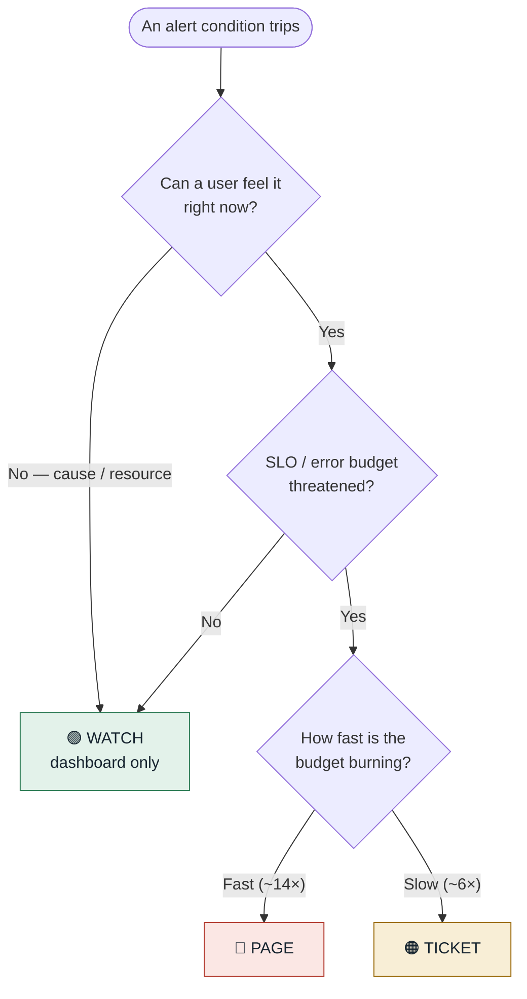

# Cloud-Native Observability — Master Metrics & Alerts Reference

A generic, vendor-neutral master catalog of **everything worth observing** in a cloud-native
solution — the signal types, every layer of the stack, the cross-cutting dimensions
(security, cost, business, data quality, AI/LLM, delivery), and a categorized Azure service
map. Metric names follow OpenTelemetry / Prometheus conventions.

📖 **The full catalog lives in [`CATALOG.md`](./CATALOG.md).**

> **All thresholds are starting points — tune against your own SLOs and baselines.**

## Repo contents

| Path | What it is |
|------|------------|
| [`CATALOG.md`](./CATALOG.md) | The master catalog — 40 sections, every metric as `Metric · Method · Action · description`. **Part D** maps every role across **Azure / AWS / GCP**. |
| [`dashboards/`](./dashboards/) | Importable **Grafana** dashboards as code — Golden Signals, RED-by-endpoint, USE-by-resource |
| [`alerts/`](./alerts/) | Generic **Prometheus** alert rules — multi-window burn-rate SLO alerts + USE/RED/K8s/messaging/cert rules |

Use the catalog to decide *what* to measure, Part D's cloud map to find the *service* on your
cloud (Azure / AWS / GCP), and the dashboards + alerts as a *starting implementation*.

---

## How it's organized

Each metric is one table row: **Metric · Method · Action · Detailed description** (what it
measures, why it matters, and the recommended alert with its rationale).

The **Method** says why the metric exists; the **Action** says what an alert should do:

| Method | Meaning | | Action | Meaning |
|--------|---------|---|--------|---------|
| `RED` | Rate · Errors · Duration | | 🔴 | **Page** — wake a human (user-visible SLO burn / data loss) |
| `USE` | Utilization · Saturation · Errors | | 🟠 | **Ticket** — attention soon, auto-file an issue |
| `GOLD` | Golden Signals | | 🟢 | **Watch** — dashboard/diagnosis only, don't alert |
| `4KM` | Four Key Metrics (DORA) | | | |
| `BIZ` | Business / product signal | | | |

The whole alerting discipline in one picture — page only on what a user can feel, scaled to how fast the error budget is burning:

## Coverage at a glance — category × method

How many metrics each category carries, split by **Method**. RED and USE dominate
(the request paths and the resources they run on); GOLD is the user-facing umbrella;
**4KM** and **BIZ** concentrate in the delivery, business, and operational sections.
**316 metrics across 41 categories.**

| # · Category | GOLD | RED | USE | 4KM | BIZ | — | **Total** |
|--------------|:----:|:---:|:---:|:---:|:---:|:-:|:---------:|
| **Part B · 18 stack layers** | **36** | **61** | **71** | | **2** | **2** | **172** |
| 01 · Frontend / RUM | 4 | 4 | | | 1 | | 9 |
| 02 · API Gateway / Ingress | 1 | 6 | 2 | | | | 9 |
| 03 · Service / Application | 3 | 5 | 4 | | | | 12 |
| 04 · Service Mesh / Sidecar | 1 | 3 | 2 | | | | 6 |
| 04a · Tracing & APM | 4 | 3 | 2 | | | 2 | 11 |
| 05 · Network | 1 | 1 | 8 | | | | 10 |
| 06 · Load Balancer | 4 | 1 | 2 | | | | 7 |
| 07 · DNS / TLS / Certificates | | 5 | 1 | | | | 6 |
| 08 · CDN / Edge | | 3 | 3 | | | | 6 |
| 09 · Database — Relational | 1 | 5 | 9 | | | | 15 |
| 10 · Database — NoSQL | 1 | 2 | 4 | | | | 7 |
| 11 · Cache | 1 | 2 | 6 | | | | 9 |
| 12 · Messaging / Streaming | 7 | 3 | 1 | | | | 11 |
| 13 · Storage (object/block/file) | 1 | 3 | 4 | | | | 8 |
| 14 · Host / VM / Compute | | | 10 | | | | 10 |
| 15 · Container Runtime | | 2 | 3 | | | | 5 |
| 16 · Kubernetes Platform | 3 | 6 | 8 | | | | 17 |
| 17 · Serverless / FaaS | 3 | 4 | 1 | | | | 8 |
| 18 · Batch / Jobs | 1 | 3 | 1 | | 1 | | 6 |
| **Part B′ · 8 protocol/workload layers** | **9** | **22** | **10** | | **5** | | **46** |
| 19 · gRPC / RPC | | 3 | 1 | | | | 4 |
| 20 · GraphQL | | 2 | 3 | | | | 5 |
| 21 · Real-time (WS/SSE/MQTT) | 1 | 3 | 1 | | | | 5 |
| 22 · Search Engine | 2 | 2 | 3 | | | | 7 |
| 23 · Vector / Embedding DB | 2 | 1 | 1 | | 1 | | 5 |
| 24 · Mobile App | 1 | 4 | | | 1 | | 6 |
| 25 · Notifications (email/SMS/push) | 1 | 5 | | | 1 | | 7 |
| 26 · Third-party / SaaS deps | 2 | 2 | 1 | | 2 | | 7 |
| **Part C · 7 cross-cutting dimensions** | **13** | **16** | **11** | **5** | **14** | | **59** |
| 27 · Security & Identity | 3 | 6 | 3 | | | | 12 |
| 28 · Cost / FinOps | | | 4 | | 3 | | 7 |
| 29 · Business / Product KPIs | 1 | | | | 6 | | 7 |
| 30 · Data Pipeline / Quality | 3 | 1 | 1 | | 3 | | 8 |
| 31 · AI / ML / LLM Serving | 2 | 6 | 3 | | 2 | | 13 |
| 32 · CI/CD & Delivery (DORA) | | 2 | | 5 | | | 7 |
| 33 · Backup / DR | 4 | 1 | | | | | 5 |
| **Part C′ · 7 operational dimensions** | **6** | **4** | **13** | **3** | **11** | **2** | **39** |
| 34 · Alerting & On-call Health | | | | 3 | 7 | | 10 |
| 35 · Capacity Planning | 1 | | 4 | | | | 5 |
| 36 · Multi-tenancy | 2 | 1 | 2 | | | | 5 |
| 37 · Quotas & Service Limits | | 1 | 1 | | | 1 | 3 |
| 38 · Compliance / Governance | 2 | | 4 | | 1 | | 7 |
| 39 · Telemetry Pipeline & Cost | 1 | 2 | 1 | | 2 | | 6 |
| 40 · Sustainability / GreenOps | | | 1 | | 1 | 1 | 3 |
| **All categories** | **64** | **103** | **105** | **8** | **32** | **4** | **316** |

> **—** = diagnostic-only signals with no single method (trace sampling/exemplar coverage,
> quota-increase lead time, carbon-aware scheduling). Blank cells are zero. Counts are derived
> from `CATALOG.md` — regenerate if you add or remove rows.

## Contents of `CATALOG.md`

1. **Methods & their theory** — where RED / USE / Golden Signals / DORA come from
2. **Glossary & abbreviations** — ~80 terms expanded
3. **Part A** — the signal types (metrics, logs, traces, RUM, synthetic, …)
4. **Part B** — 18 stack layers (frontend → API gateway → service → network → DB → K8s → …)
5. **Part B′** — 8 protocol/workload layers (gRPC, GraphQL, real-time, search, vector DB, mobile, …)
6. **Part C** — 7 cross-cutting dimensions (security, cost, business, data quality, AI/LLM, DORA, DR)
7. **Part C′** — 7 operational dimensions (alerting health, capacity, multi-tenancy, quotas, compliance, …)
8. **Part D** — cloud service map: every role across **Azure / AWS / GCP**, by category
9. **Part E** — operating the system (SLI/SLO/SLA, thresholds, severity, alert lifecycle)

## Key references

- **Azure Monitor Baseline Alerts (AMBA)** — <https://azure.github.io/azure-monitor-baseline-alerts/>
- **Google SRE Book / Workbook** — <https://sre.google/books/>
- **OpenTelemetry semantic conventions** — <https://opentelemetry.io/docs/specs/semconv/>
- **RED method** · **USE method** · **DORA / Four Keys** · **CNCF Observability Whitepaper**

(Full link list at the end of `CATALOG.md`.)

## License

Released under the [MIT License](./LICENSE) — free to use, adapt, and share with attribution.

---

*Generic, vendor-neutral reference. Tune all thresholds to your SLOs.*
